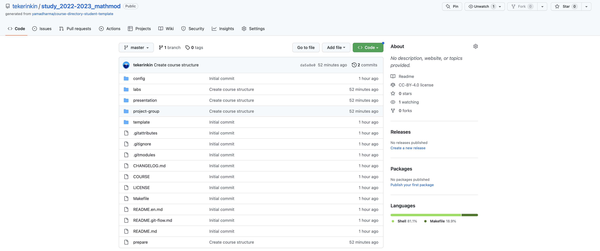
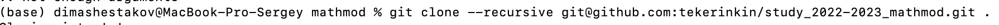

---
## Front matter
lang: ru-RU
title: Презентация лабораторной работы №1
subtitle: Математическое моделирование
author:
  - Шестаков Д. С.
institute:
  - Российский университет дружбы народов, Москва, Россия
date: 11 февраля 2023

## i18n babel
babel-lang: russian
babel-otherlangs: english

## Formatting pdf
toc: false
toc-title: Содержание
slide_level: 2
aspectratio: 169
section-titles: true
theme: metropolis
header-includes:
 - \metroset{progressbar=frametitle,sectionpage=progressbar,numbering=fraction}
 - '\makeatletter'
 - '\beamer@ignorenonframefalse'
 - '\makeatother'
---

# Информация

## Докладчик

:::::::::::::: {.columns align=center}
::: {.column width="70%"}

  * Шестаков Дмитрий Сергеевич
  * группа НКНбд-01-20
  * Факультет физико-математических и естественных наук
  * Российский университет дружбы народов
  * [dmshestakov@icloud.com](mailto:dmshestakov@icloud.com)
  * <https://github.com/tekerinkin>

:::
::::::::::::::

# Вводная часть

## Актуальность

- Для успешного выполнения рабочих задач необходимо умение использовать git, Markdown и командную строку
- Для успешного выполнения последующих лабораторных работ необходим единый шаблон для их оформления

## Объект и предмет исследования

- Технология git
- Технология Markdown

## Цели и задачи

- Создать шаблон репозитория для выполнения лабораторных работ
- Освежить и дополнить навыки владения git, Markdown, командной строкой

## Материалы и методы

- Процессор `pandoc` для входного формата Markdown
- Результирующие форматы
	- `pdf`
	- `html`
- Автоматизация процесса создания: `Makefile`
- Технология git

# Выполнение лабораторной работы

## Создание удаленного репозитория

- Используя встроенные функции сервиса Github создали удаленный репозиторий из шаблона
- Репозиторий: <https://github.com/tekerinkin/study_2022-2023_mathmod>

{#fig:001 width=70%}

## Создание каталога и клонирование удаленного репозитория

- Используя командную строку, создали каталог требуемой структуры и клонировали удаленный репозиторий

{#fig:002 width=70%}
{#fig:003 width=70%}

## Настройка необходимой иерархии

- Используя командную строку и команду `make` настроили необходимую иерархию

{#fig:004 width=70%}

## Написание отчета

- Используя Markdown и vim написали отчет о проделанной работе

{#fig:005 width=70%}

# Результаты

Настроили все необходимые каталоги и репозитории для успешного выполнения последующих лабораторных работ.

Освежили и дополнили навыки по работе с Markdown, git и командной строкой.