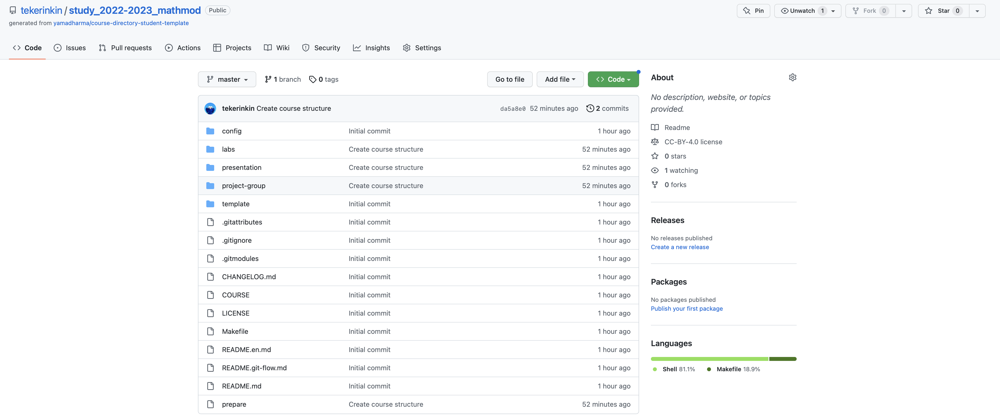
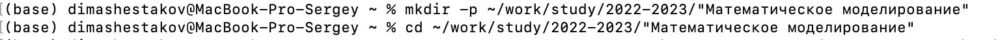
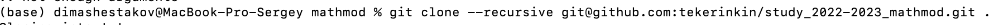
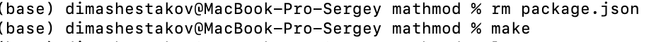
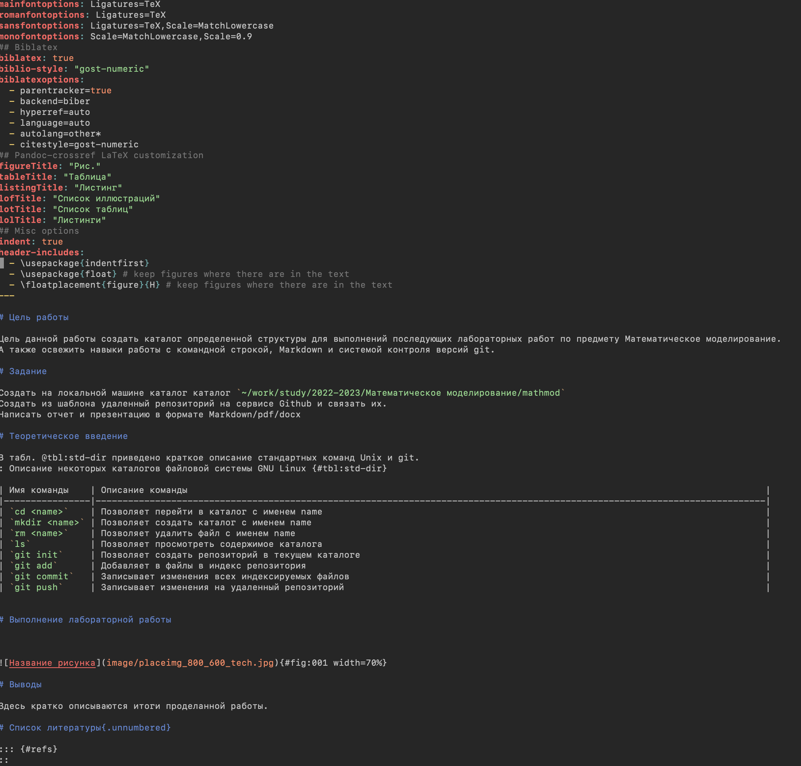

---
## Front matter
title: "Шаблон отчёта по лабораторной работе"
subtitle: "Простейший вариант"
author: "Дмитрий Сергеевич Шестаков"

## Generic otions
lang: ru-RU
toc-title: "Содержание"

## Bibliography
bibliography: bib/cite.bib
csl: pandoc/csl/gost-r-7-0-5-2008-numeric.csl

## Pdf output format
toc: true # Table of contents
toc-depth: 2
lof: true # List of figures
lot: true # List of tables
fontsize: 12pt
linestretch: 1.5
papersize: a4
documentclass: scrreprt
## I18n polyglossia
polyglossia-lang:
  name: russian
  options:
	- spelling=modern
	- babelshorthands=true
polyglossia-otherlangs:
  name: english
## I18n babel
babel-lang: russian
babel-otherlangs: english
## Fonts
mainfont: PT Serif
romanfont: PT Serif
sansfont: PT Sans
monofont: PT Mono
mainfontoptions: Ligatures=TeX
romanfontoptions: Ligatures=TeX
sansfontoptions: Ligatures=TeX,Scale=MatchLowercase
monofontoptions: Scale=MatchLowercase,Scale=0.9
## Biblatex
biblatex: true
biblio-style: "gost-numeric"
biblatexoptions:
  - parentracker=true
  - backend=biber
  - hyperref=auto
  - language=auto
  - autolang=other*
  - citestyle=gost-numeric
## Pandoc-crossref LaTeX customization
figureTitle: "Рис."
tableTitle: "Таблица"
listingTitle: "Листинг"
lofTitle: "Список иллюстраций"
lotTitle: "Список таблиц"
lolTitle: "Листинги"
## Misc options
indent: true
header-includes:
  - \usepackage{indentfirst}
  - \usepackage{caption}
  - \usepackage{float} # keep figures where there are in the text
  - \floatplacement{figure}{H} # keep figures where there are in the text
---

# Цель работы

Цель данной работы создать каталог определенной структуры для выполнений последующих лабораторных работ по предмету Математическое моделирование.
А также освежить навыки работы с командной строкой, Markdown и системой контроля версий git.

# Задание

Создать на локальной машине каталог каталог `~/work/study/2022-2023/Математическое моделирование/mathmod`
Создать из шаблона удаленный репозиторий на сервисе Github и связать их.
Написать отчет и презентацию в формате Markdown/pdf/docx

# Теоретическое введение

В табл. @tbl:std-dir приведено краткое описание стандартных команд Unix и git.

| Имя команды    | Описание команды                                                                                                           |
|----------------|----------------------------------------------------------------------------------------------------------------------------|
| `cd`           | Позволяет перейти в каталог с именем name                                                                                  |
| `mkdir `       | Позволяет создать каталог с именем name                                                                                    |
| `rm `          | Позволяет удалить файл с именем name                                                                                       |
| `ls`           | Позволяет просмотреть содержимое каталога                                                                                  |
| `git init`     | Позволяет создать репозиторий в текущем каталоге                                                                           |
| `git add`      | Добавляет в файлы в индекс репозитория                                                                                     |
| `git commit`   | Записывает изменения всех индексируемых файлов                                                                             |
| `git push`     | Записывает изменения на удаленный репозиторий                                                                              |

: Описание некоторых команд операционной системы MacOS {#tbl:std-dir}

# Выполнение лабораторной работы

Создали удаленный репозиторий на Github (рис. @fig:001).

{#fig:001 width=70%}

Создали каталог требуемой структуры (рис. @fig:002).

{#fig:002 width=70%}

Клонировали удаленный репозиторий в созданный каталог (рис. @fig:003).

{#fig:003 width=70%}

Настроили необходимую иерархию каталога используя команду `make` (рис. @fig:004).

{#fig:004 width=70%}

Написали отчет в формате Markdown (рис. @fig:005)

{#fig:005 width=70%}

# Выводы

Освежили и дополнили свои навыки по работе с командой строкой, Markdown и git.
Создали все необходимые каталоги и репозитории для выполнения последующих лабораторных работ.

