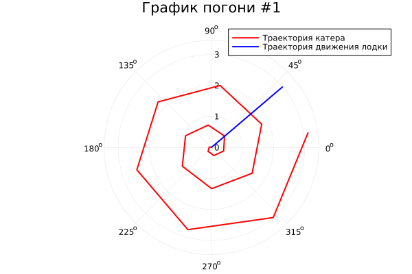
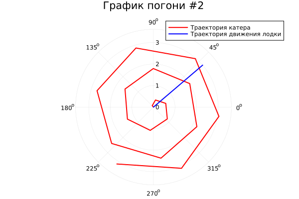

---
## Front matter
title: "Отчет по лабораторной работе"
subtitle: "Лабораторная работа №2"
author: "Дмитрий Сергеевич Шестаков"

## Generic otions
lang: ru-RU
toc-title: "Содержание"

## Bibliography
bibliography: bib/cite.bib
csl: pandoc/csl/gost-r-7-0-5-2008-numeric.csl

## Pdf output format
toc: true # Table of contents
toc-depth: 2
lof: true # List of figures
lot: true # List of tables
fontsize: 12pt
linestretch: 1.5
papersize: a4
documentclass: scrreprt
## I18n polyglossia
polyglossia-lang:
  name: russian
  options:
	- spelling=modern
	- babelshorthands=true
polyglossia-otherlangs:
  name: english
## I18n babel
babel-lang: russian
babel-otherlangs: english
## Fonts
mainfont: PT Serif
romanfont: PT Serif
sansfont: PT Sans
monofont: PT Mono
mainfontoptions: Ligatures=TeX
romanfontoptions: Ligatures=TeX
sansfontoptions: Ligatures=TeX,Scale=MatchLowercase
monofontoptions: Scale=MatchLowercase,Scale=0.9
## Biblatex
biblatex: true
biblio-style: "gost-numeric"
biblatexoptions:
  - parentracker=true
  - backend=biber
  - hyperref=auto
  - language=auto
  - autolang=other*
  - citestyle=gost-numeric
## Pandoc-crossref LaTeX customization
figureTitle: "Рис."
tableTitle: "Таблица"
listingTitle: "Листинг"
lofTitle: "Список иллюстраций"
lotTitle: "Список таблиц"
lolTitle: "Листинги"
## Misc options
indent: true
header-includes:
  - \usepackage{indentfirst}
  - \usepackage{float} # keep figures where there are in the text
  - \usepackage{mathtools}
  - \usepackage{amsmath}
  - \floatplacement{figure}{H} # keep figures where there are in the text
---

# Цель работы

Изучить основы языков программирования Julia и Openmodelica. Смоделировать и решить метматическую задачу о погоне. Освоить средства для численного решения задачи Коши и построения графиков. 


# Задание

На море в тумане катер береговой охраны преследует лодку браконьеров. Через определенный промежуток времени туман рассеивается, и лодка обнаруживается на расстоянии 8,1 км от катера. Затем лодка снова скрывается в тумане и уходит прямолинейно в неизвестном направлении. Известно, что скорость катера в 3,2 раза больше скорости браконьерской лодки.
1. Записать уравнение, описывающее движение катера, с начальными условиями для двух случаев (в зависимости от расположения катера относительно лодки в начальный момент времени).
2. Построить траекторию движения катера и лодки для двух случаев.
3. Найти точку пересечения траектории катера и лодки

# Теоретическое введение

**Julia** — высокоуровневый высокопроизводительный свободный язык программирования с динамической типизацией, созданный для математических вычислений. Эффективен также и для написания программ общего назначения. Синтаксис языка схож с синтаксисом других математических языков (например, MATLAB и Octave), однако имеет некоторые существенные отличия. Julia написан на Си, C++ и Scheme. Имеет встроенную поддержку многопоточности и распределённых вычислений, реализованные в том числе в стандартных конструкциях.


**OpenModelica** — свободное открытое программное обеспечение для мо- делирования, симуляции, оптимизации и анализа сложных динамических систем. Основано на языке Modelica. Активно развивается Open Source Modelica Consortium, некоммерческой неправительственной организацией. Open Source Modelica Consortium является совместным проектом RISE SICS East AB и Линчёпингского университета. По своим возможностям приближается к таким вычислительным средам как Matlab Simulink, Scilab xCos, имея при этом значительно более удобное представление системы уравнений исследуемого блока.


# Выполнение лабораторной работы

## Аналитическое решение задачи

1. Примем за начало отсчета момент, когда катер береговой охраны впервые увидел из-за тумана лодку браконьеров.

2. Введем полярные координаты. Полюсом будет местонахождение лодки браконьеров в начальный момент времени. Тогда начальные координаты катера береговой охраны 
$(8.1;0)$ . Обозначим скорость лодки - $v$, тогда скорость катера равна $3.2v$

3. Траектория катера должна быть такой, чтобы и катер, и лодка все время были на одном расстоянии от полюса. Только в этом случае траектория катера пересечется с траекторией лодки. Поэтому для начала катер береговой охраны должен двигаться некоторое время прямолинейно, пока не окажется на том же расстоянии от полюса, что и лодка браконьеров. После этого катер береговой охраны должен двигаться вокруг полюса удаляясь от него с той же скоростью, что и лодка браконьеров.

4. Для начала, найдем $x$ - расстояние после которого катер береговой охраны начнет двигаться вокруг полюса. Для этого предположим, что через некоторое время катер и лодка будут находиться на одном расстоянии от полюса и оно, соответственно, будет равно $x$. Обозначим это время $t$. За время $t$ лодка проплывет $x$, а катер - $8.1 + x$(или $8.1 - x$, в зависимости от первоначального положения катера относительно полюса). Следовательно, мы можем записать следующие уравнения:

$$\frac{x}{v} = \frac{8.1+x}{3.2v}$$

$$\frac{x}{v} = \frac{8.1-x}{3.2v}$$

Отсюда имеем: $$x_1 = \frac{81}{22}, x_2 = \frac{81}{42}$$

5. После того, как катер береговой охраны окажется на одном расстоянии от полюса, что и лодка, он должен сменить прямолинейную траекторию и начать двигаться вокруг полюса удаляясь от него со скосростью лодки $v$. Когда катер начнет двигаться вокруг полюса, его скорость можно будет разложить на две составлющие: радиальную $v_r$ и тенгенциальную $v_\tau$.

$$v_r = \frac{dr}{dt} = v$$

$$v_\tau = r\frac{d\theta}{dt} = \sqrt{v^2 - v_r^2} = \sqrt{9.24}v$$

6. Решение исходной задачи сводится к решению системы из двух дифференциальных уравнений

$$\begin{cases}
  \frac{dr}{dt} = v \\
  r\frac{d\theta}{dt} = \sqrt{9.24}
\end{cases}$$

с начальными условиями: 
$$\begin{cases}
  \theta_0 = 0 \\
  r_0 = x_1
\end{cases}$$

или 
$$\begin{cases}
  \theta_0 = -\pi \\
  r_0 = x_2
\end{cases}$$

Исключая из полученной системы производную по $t$, можно перейти к следующему уравнению: $$\frac{dr}{d\theta} = \frac{r}{\sqrt{9.24}}$$
Начальные условия остаются прежними. Решив это уравнение, мы получим траекторию движения катера в полярных координатах.

## Решение программными средствами

1. Решаем дифференциальное уравнение на языке Julia с использованием библиотеки DifferentialEquations и Plots.

```julia
using DifferentialEquations
using Plots

#изначальное расстояние между катером и лодкой
k = 8.1

phi = 3*pi/4

#Правая часть дифф.уравнения
ode_fn(r, p, t) = r/sqrt(9.24)

f(t) = t*tan(phi)

t_begin = 0.0
t_end = pi
tspan_1 = (t_begin, t_end)

tspan_2 = (-pi, 0)

boot_values = fill(sqrt(2)/2,4)

#начальное условие
r_01 = k/2.2
r_02 = k/4.2

prob1 = ODEProblem(ode_fn, r_01, tspan_1)
sol1 = solve(prob1, Tsit5(), reltol=1e-8, abstol=1e-8)

prob2 = ODEProblem(ode_fn, r_02, tspan_2)
sol2 = solve(prob2, Tsit5(), reltol=1e-8, abstol=1e-8)

plot(proj = :polar,
     sol1.t,
     linewidth = 2,
     title = "График погони #1",
     label = "Траектория катера",
     color =:red,
     legend = true)

plot!(boot_values, collect(0:3), linewidth = 2, label="Траектория движения лодки",
color =:blue,
legend=true)

plot(proj = :polar,
     sol2.t,
     linewidth = 2,
     title = "График погони #2",
     label = "Траектория катера",
     color =:red,
     legend = true)

plot!(boot_values, collect(0:3), linewidth = 2, label="Траектория движения лодки",
color =:blue,
legend=true)
```

{#fig:001 width=70%}

{#fig:002 width=70%}

# Вывод

Произведен вывод и решение дифференциальных уравнений для решения поставленной задачи. На примере решения задачи о погоне отработаны навыки владения языком программирования Julia. Также было установлено, что стандартные средства языка Openmodelica не позволяют решить поставленную задачу, так как этот язык представляет иную парадигму программирования - декларативную.

# Список литературы

1. Wikipedia Julia [Электронный ресурс]. URL: ["wikipedia.org/Julia"](https://ru.wikipedia.org/wiki/Julia_(язык_программирования))
2. Wikipedia Openmodelica [Электронный ресурс]. URL: ["wikipedia.org/OpenModelica"](https://ru.wikipedia.org/wiki/OpenModelica)
3. Julia Manual [Электронный ресурс]. URL:["docs.julialang.org"](https://docs.julialang.org/en/v1/manual/getting-started/)