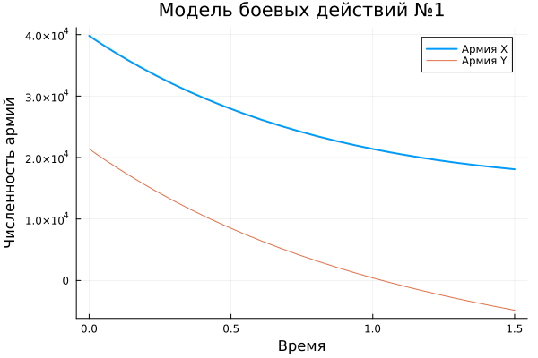
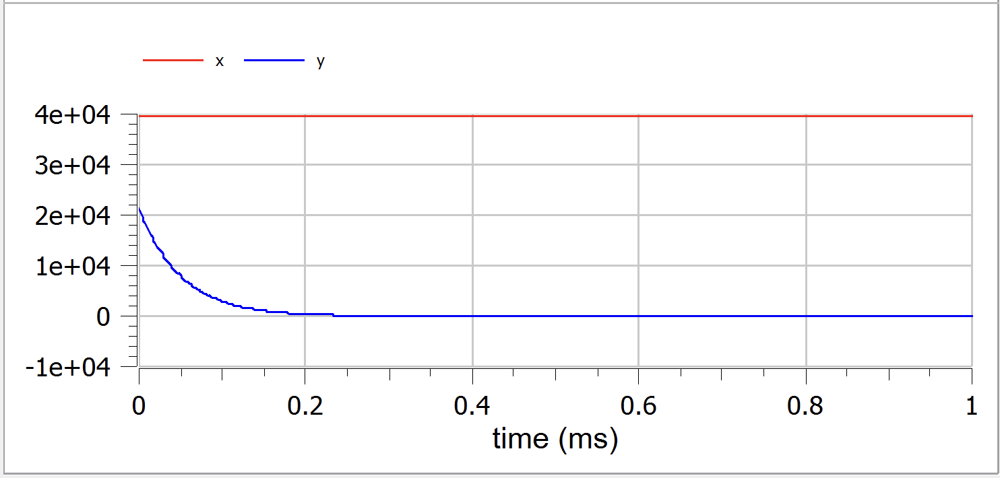

---
## Front matter
lang: ru-RU
title: Лабораторная работа №3
subtitle: Модель боевых действий
author:
  - Шестаков Д. С.
institute:
  - Российский университет дружбы народов, Москва, Россия
date: 25.02.2023

## i18n babel
babel-lang: russian
babel-otherlangs: english

## Formatting pdf
toc: false
toc-title: Содержание
slide_level: 2
aspectratio: 169
section-titles: true
theme: metropolis
header-includes:
 - \metroset{progressbar=frametitle,sectionpage=progressbar,numbering=fraction}
 - '\makeatletter'
 - '\beamer@ignorenonframefalse'
 - '\makeatother'
---

# Информация

## Докладчик

:::::::::::::: {.columns align=center}
::: {.column width="70%"}

  * Шестаков Дмитрий Сергеевич
  * студент группы НКНбд-01-20
  * Российский университет дружбы народов
  * [dmshestakov@icloud.com](mailto:dmshestakov@icloud.com)
  * <https://github.com/tekerinkin>

:::

::::::::::::::

# Вводная часть

## Актуальность

- Модель боевых действий позволяет в некотором приближении оценить, на стороне какой армии находится преимущество
- Подобная модель отлично подходит для отработки навыков владения Julia и Openmodelica

## Объект и предмет исследования

- Математическая модель боевых действий
- Язык программирования Julia
- Язык программирования Modelica

## Цели и задачи

- Смоделировать конкретные боевые действия из предложенного варината
- Реализовать данную модель на языке Julia и построить график
- Реализовать данную модель на языке Modelica и построить график

## Материалы и методы

- Язык программирования Julia
- Язык программирования Modelica
- Пакеты Plots и DifferentialEquations

# Реализация

## Постановка задачи

Между страной $X$ и страной $Y$ идет война. Численность состава войск исчисляется от начала войны, и являются временными функциями $x(t)$ и $y(t)$. В начальный момент времени страна $X$ имеет армию ***39800***, а в распоряжении страны $Y$ армия численностью ***21400*** человек. Для упрощения модели считаем, что коэффициенты $a,b,c,h$ постоянны. Также считаем $P(t)$ и $Q(t)$ непрерывные функции.

  Постройте графики изменения численности войск армии $X$ и армии $Y$ для следующих случаев:

## Случай 1

1. Модель боевых действий между регулярными войсками.

  $$\frac{dx}{dt} = -0.42x(t) - 0.68y(t) + sin(5t+1)$$
  $$\frac{dy}{dt} = -0.59x(t) - 0.43y(t) + cos(5t+2)$$

## Случай 2

2. Модель ведения боевых действий с участием регулярных войск и партизанских отрядов.

  $$\frac{dx}{dt} = -0.301x(t) - 0.7y(t) + sin(20t) + 1$$
  $$\frac{dy}{dt} = -0.502x(t)y(t) - 0.4y(t) + cos(20t) + 1$$

## Реализация первого случая (Julia)

```julia
function ode_fn(du, u, p, t)
    x, y = u
    du[1] = -0.42*x - 0.68*y + sin(5*t+1)
    du[2] = -0.59*x - 0.43*y + cos(5*t+2)
end
#Initial condition
x_init = 39800
y_init = 21400
prob = ODEProblem(ode_fn, [x_init, y_init], tspan)
sol = solve(prob, Tsit5(), reltol=1e-8, abstol=1e-8)
x_sol = [u[1] for u in sol.u]
y_sol = [u[2] for u in sol.u]
```

## Реализация первого случая (Modelica)

```modelica
model battle
  Real x, y, t;

initial equation
  t = 0;
  x = 39800;
  y = 21400;
equation
  der(t) = 1;
  der(x) = -0.42*x - 0.68*y + sin(5*t+1);
  der(y) = -0.59*x - 0.43*y + cos(5*t+2);
end battle;
```

## Реализация второго случая (Julia)

```julia
function ode_fn_1(du, u, p, t)
    x, y = u
    du[1] = -0.301*x - 0.7*y + sin(20*t) + 1
    du[2] = -0.502*x*y - 0.4*y + cos(20*t) + 1
end
#Initial condition
x_init = 39800
y_init = 21400
prob1 = ODEProblem(ode_fn_1, [x_init, y_init], tspan)
sol1 = solve(prob1, Tsit5(), reltol=1e-16, abstol=1e-16)
x_sol_1 = [u[1] for u in sol1.u]
y_sol_1 = [u[2] for u in sol1.u]
```

## Реализация второго случая (Modelica)

```modelica
model battle
  Real x, y, t;
initial equation
  t = 0;
  x = 39800;
  y = 21400;
equation
  der(t) = 1;
  der(x) = -0.301*x - 0.7*y + sin(20*t) + 1;
  der(y) = -0.502*x*y - 0.4*y + cos(20*t) + 1;
end battle;
```
# Результаты

## Графики первого случая

{#fig:001 width=70%}

## Графики первого случая

{#fig:003 width=70%}

## Графики второго случая

{#fig:001 width=70%}

## Графики второго случая

{#fig:003 width=70%}

# Вывод

Смоделировали конкретный случай боевых действия с использованием языков Julia и Openmodelica. В нашем случае, очевидно, побеждает армия $X$. Это отлично видно из графика. В частности, во втором случае(с партизанскими отрядами) армия $Y$ очень быстро потерпит поражение.