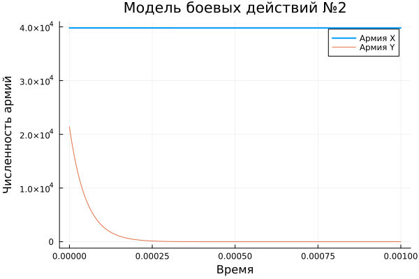
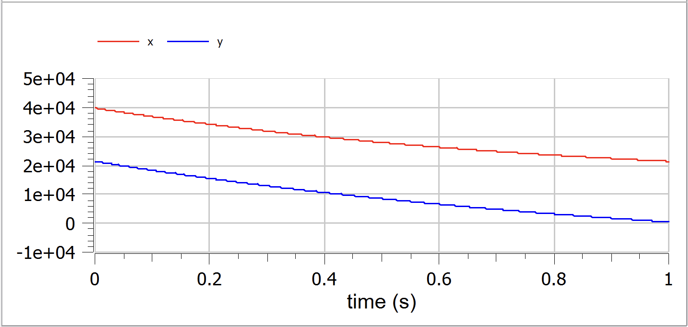

---
## Front matter
title: "Отчет по лабораторной работе №3"
subtitle: "Модель боевых действий"
author: "Дмитрий Сергеевич Шестаков"

## Generic otions
lang: ru-RU
toc-title: "Содержание"

## Bibliography
bibliography: bib/cite.bib
csl: pandoc/csl/gost-r-7-0-5-2008-numeric.csl

## Pdf output format
toc: true # Table of contents
toc-depth: 2
lof: true # List of figures
lot: true # List of tables
fontsize: 12pt
linestretch: 1.5
papersize: a4
documentclass: scrreprt
## I18n polyglossia
polyglossia-lang:
  name: russian
  options:
	- spelling=modern
	- babelshorthands=true
polyglossia-otherlangs:
  name: english
## I18n babel
babel-lang: russian
babel-otherlangs: english
## Fonts
mainfont: PT Serif
romanfont: PT Serif
sansfont: PT Sans
monofont: PT Mono
mainfontoptions: Ligatures=TeX
romanfontoptions: Ligatures=TeX
sansfontoptions: Ligatures=TeX,Scale=MatchLowercase
monofontoptions: Scale=MatchLowercase,Scale=0.9
## Biblatex
biblatex: true
biblio-style: "gost-numeric"
biblatexoptions:
  - parentracker=true
  - backend=biber
  - hyperref=auto
  - language=auto
  - autolang=other*
  - citestyle=gost-numeric
## Pandoc-crossref LaTeX customization
figureTitle: "Рис."
tableTitle: "Таблица"
listingTitle: "Листинг"
lofTitle: "Список иллюстраций"
lotTitle: "Список таблиц"
lolTitle: "Листинги"
## Misc options
indent: true
header-includes:
  - \usepackage{indentfirst}
  - \usepackage{float} # keep figures where there are in the text
  - \floatplacement{figure}{H} # keep figures where there are in the text
  - \usepackage{amsmath}
---

# Цель работы

Изучить и отработать навыки работы с языками программирования Julia и Openmodelica. Освоить основные библиотеки данных языков для решения дифференциальных уравнений и построения графиков. Закрепить на практике полученные знания. Решить математическую задачу моделирования боевых действий.

# Задание

Между страной $X$ и страной $Y$ идет война. Численность состава войск исчисляется от начала войны, и являются временными функциями $x(t)$ и $y(t)$. В начальный момент времени страна $X$ имеет армию ***39800***, а в распоряжении страны $Y$ армия численностью ***21400*** человек. Для упрощения модели считаем, что коэффициенты $a,b,c,h$ постоянны. Также считаем $P(t)$ и $Q(t)$ непрерывные функции.

  Постройте графики изменения численности войск армии $X$ и армии $Y$ для следующих случаев:

  1. Модель боевых действий между регулярными войсками

  $$\frac{dx}{dt} = -0.42x(t) - 0.68y(t) + sin(5t+1)$$
  $$\frac{dy}{dt} = -0.59x(t) - 0.43y(t) + cos(5t+2)$$

  2. Модель ведения боевых действий с участием регулярных войск и партизанских отрядов

  $$\frac{dx}{dt} = -0.301x(t) - 0.7y(t) + sin(20t) + 1$$
  $$\frac{dy}{dt} = -0.502x(t)y(t) - 0.4y(t) + cos(20t) + 1$$

# Теоретическое введение

**Julia** — высокоуровневый высокопроизводительный свободный язык про- граммирования с динамической типизацией, созданный для математических вычислений. Эффективен также и для написания программ общего назначения. Синтаксис языка схож с синтаксисом других математических языков (например, MATLAB и Octave), однако имеет некоторые существенные отличия. Julia написан на Си, C++ и Scheme. Имеет встроенную поддержку многопоточности и распределённых вычислений, реализованные в том числе в стандартных конструкциях.[1]


**OpenModelica** — свободное открытое программное обеспечение для мо- делирования, симуляции, оптимизации и анализа сложных динамических систем. Основано на языке Modelica. Активно развивается Open Source Modelica Consortium, некоммерческой неправительственной организацией. Open Source Modelica Consortium является совместным проектом RISE SICS East AB и Линчёпингского университета. По своим возможностям приближается к таким вычислительным средам как Matlab Simulink, Scilab xCos, имея при этом значительно более удобное представление системы уравнений исследуемого блока.[2]

**Законы Ланчестера (законы Осипова — Ланчестера)** — математическая формула для расчета относительных сил пары сражающихся сторон — подразделений вооруженных сил. В статье «Влияние численности сражающихся сторон на их потери», опубликованной журналом «Военный сборник» в 1915 году, генерал-майор Корпуса военных топографов М. П. Осипов описал математическую модель глобального вооружённого противостояния, практически применяемую в военном деле при описании убыли сражающихся сторон с течением времени и, входящую в математическую теорию исследования операций, на год опередив английского математика Ф. У. Ланчестера. Мировая война, две революции в России не позволили новой власти заявить в установленном в научной среде порядке об открытии царского офицера.
Уравнения Ланчестера — это дифференциальные уравнения, описывающие зависимость между силами сражающихся сторон A и D как функцию от времени, причем функция зависит только от A и D.[4]

# Выполнение лабораторной работы

Для моделирования данной задачи используем языки Julia и Openmodelica и пакеты DifferentialEquations, Plots.

## Реализация на Julia

```julia
using DifferentialEquations
using Plots

function ode_fn(du, u, p, t)
    x, y = u
    du[1] = -0.42*x - 0.68*y + sin(5*t+1)
    du[2] = -0.59*x - 0.43*y + cos(5*t+2)
end

t_begin = 0.0
t_end = 1.5
tspan = (t_begin, t_end)

#Initial condition
x_init = 39800
y_init = 21400

prob = ODEProblem(ode_fn, [x_init, y_init], tspan)

sol = solve(prob, Tsit5(), reltol=1e-8, abstol=1e-8)
x_sol = [u[1] for u in sol.u]
y_sol = [u[2] for u in sol.u]

plot(sol.t, x_sol, 
     linewidth=2,
     title = "Модель боевых действий №1",
     xaxis="Время",
     yaxis="Численность армий",
     label="Армия X",
     legend=true)

plot!(sol.t, y_sol,
      linewidht = 2,
      label = "Армия Y",
      legend = true)
savefig("report/image/Model_1.png")
```
{#fig:001 width=70%}

```julia
function ode_fn_1(du, u, p, t)
    x, y = u
    du[1] = -0.301*x - 0.7*y + sin(20*t) + 1
    du[2] = -0.502*x*y - 0.4*y + cos(20*t) + 1
end

t_begin = 0.0
t_end = 0.001
tspan = (t_begin, t_end)

#Initial condition
x_init = 39800
y_init = 21400

prob1 = ODEProblem(ode_fn_1, [x_init, y_init], tspan)

sol1 = solve(prob1, Tsit5(), reltol=1e-16, abstol=1e-16)
x_sol_1 = [u[1] for u in sol1.u]
y_sol_1 = [u[2] for u in sol1.u]

plot(sol1.t, x_sol_1, 
     linewidth=2,
     title = "Модель боевых действий №2",
     xaxis="Время",
     yaxis="Численность армий",
     label="Армия X",
     legend=true)

plot!(sol1.t, y_sol_1,
      linewidht = 2,
      label = "Армия Y",
      legend = true)


savefig("image/Model_2.png")
```

{#fig:002 width=70%}

## Реализация на Openmodelica

```modelica
model battle
  Real x, y, t;

initial equation
  t = 0;
  x = 39800;
  y = 21400;
equation
  der(t) = 1;
  der(x) = -0.42*x - 0.68*y + sin(5*t+1);
  der(y) = -0.59*x - 0.43*y + cos(5*t+2);
end battle;
```

{#fig:003 width=70%}

```modelica
model battle
  Real x, y, t;
initial equation
  t = 0;
  x = 39800;
  y = 21400;
equation
  der(t) = 1;
  der(x) = -0.301*x - 0.7*y + sin(20*t) + 1;
  der(y) = -0.502*x*y - 0.4*y + cos(20*t) + 1;
end battle;
```

{#fig:004 width=70%}

Из графиков  мы отчетливо видим, что в обоих случаях армия страны $X$ победит армию страны $Y$. В частности, во втором случае крайне быстро.

# Выводы

Произведено численное моделирование модели боевых действий для двух случаев: без партизан и с партизанским движением. Для этого были применены языки программирования Julia и Openmodelica и пакеты DifferentialEquations, Plots. Отработали навыки работы с вышеназванными языками программирования.


# Список литературы

1. Wikipedia Julia [Электронный ресурс]. URL: ["wikipedia.org/Julia"](https://ru.wikipedia.org/wiki/Julia_(язык_программирования))
2. Wikipedia Openmodelica [Электронный ресурс]. URL: ["wikipedia.org/OpenModelica"](https://ru.wikipedia.org/wiki/OpenModelica)
3. Julia Manual [Электронный ресурс]. URL:["docs.julialang.org"](https://docs.julialang.org/en/v1/manual/getting-started/)
4. Wikipedia Законы Ланчестера [Электронный ресурс]. URL: ["wikipedia.org/Законы_Ланчестера"](https://ru.wikipedia.org/wiki/Законы_Осипова_—_Ланчестера)