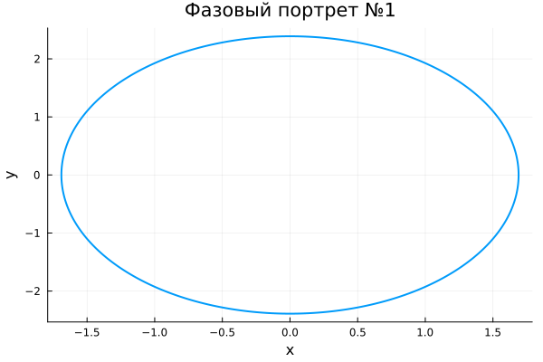
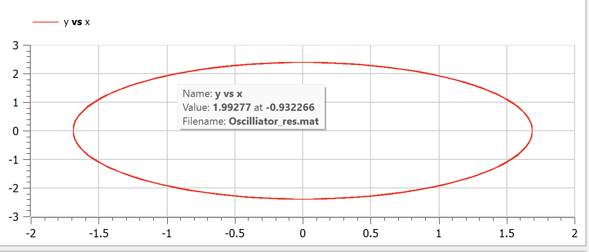
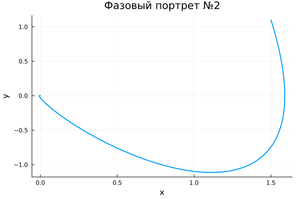
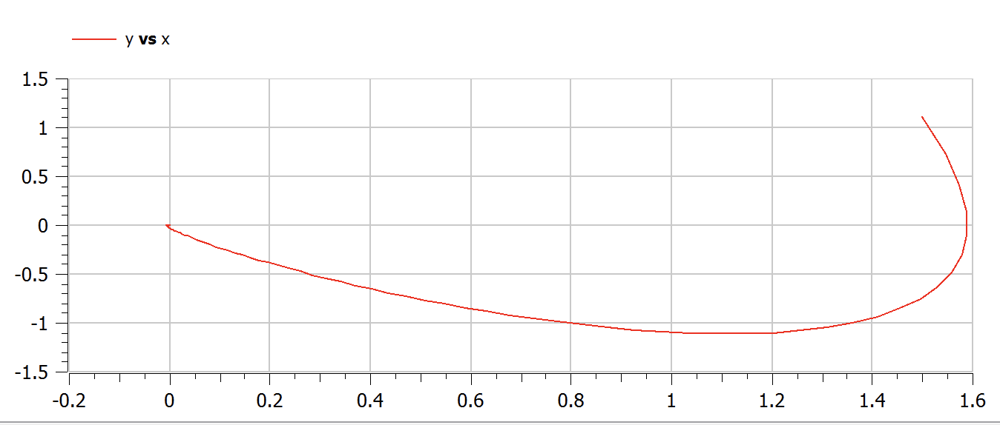
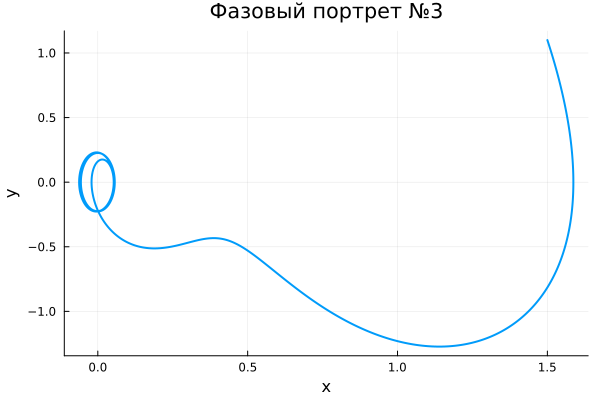
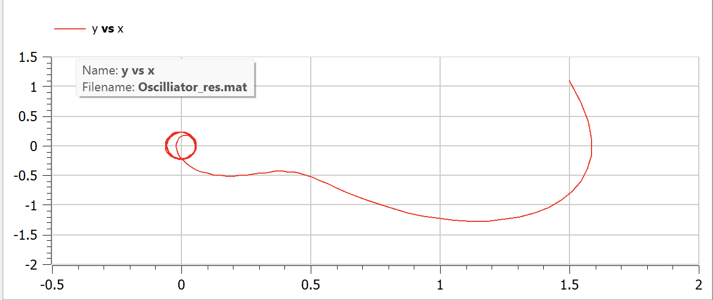

---
## Front matter
lang: ru-RU
title: Лабораторная работа №4
subtitle: Модель гармонических колебаний
author:
  - Шестаков Д. С.
institute:
  - Российский университет дружбы народов, Москва, Россия
date: 04 марта 2023

## i18n babel
babel-lang: russian
babel-otherlangs: english

## Formatting pdf
toc: false
toc-title: Содержание
slide_level: 2
aspectratio: 169
section-titles: true
theme: metropolis
header-includes:
 - \metroset{progressbar=frametitle,sectionpage=progressbar,numbering=fraction}
 - '\makeatletter'
 - '\beamer@ignorenonframefalse'
 - '\makeatother'
 - \usepackage{amsmath}
---

# Информация

## Докладчик

:::::::::::::: {.columns align=center}
::: {.column width="70%"}

  * Шестаков Дмитрий Сергеевич
  * студент группы НКНбд-01-20
  * Факультет физико-математических и естественных наук
  * Российский университет дружбы народов
  * [dmshestakov@icloud.com](mailto:dmshestakov@icloud.com)
  * <https://github.com/tekerinkin>

:::
::::::::::::::

# Вводная часть

## Актуальность

 - Моеделирование гармонических колебаний позволяет решить множество задач из разных разделов физики
 - Данная задача отлично подходит для отработки навыков решения дифференциальных уравнений второго порядка на языках Julia и Openmodelica

## Объект и предмет исследования

- Модель гармонических колебаний
- Язык программирования Julia
- Язык программирования Openmodelica

## Цели и задачи

- Построить фазовый портрет для колебаний без затухания
- Построить фазовый портрет для колебаний с затуханием
- Построить фазовый портрет для колебаний с затуханием под действием внешней силы

## Материалы и методы

- Язык программирования Julia
- Язык программирования Modelica
- Пакеты Plots, DifferentialEquations

# Ход работы

## Колебания без затухания

 - Выписали уравнение, в нашем случае $$\ddot{x} + 2x = 0$$
 - Преобразовали в систему
    $$\begin{cases}
    \dot{x} = y 
    \\
    \dot{y} = -2x
    \end{cases}
    $$
  - Записали начальные условия
  $$
    \begin{cases}
      x(0) = 1.5
      \\
      y(0) = 1.1
    \end{cases}
  $$

## Решение на Julia
```julia
  function ode_fn_1(du, u, p, t)
    x, y = u
    du[1] = y
    du[2] = -2*x
end
t_begin = 0.0
t_end = 44
tspan = (t_begin, t_end)
x_init = 1.5
y_init = 1.1
prob1 = ODEProblem(ode_fn_1, [x_init, y_init], tspan)
sol1 = solve(prob1, Tsit5(), reltol=1e-16, abstol=1e-16)
```

## Решение на языке Modelica
```modelica
model Oscilliator
  Real x, y, t;
initital equation
  x = 1.5;
  y = 1.1;
  t = 0;
equation
  der(t) = 1;
  der(x) = y;
  der(y) = -2*x;
end
```

## Результаты

:::::::::::::: {.columns align=center}
::: {.column width="50%"}
{#fig:001 width=50%}
:::
::: {.column width="50%"}
{#fig:002 width=50%}
:::
::::::::::::::
## Колебания с затуханием

- Выписали уравнение, в нашем случае $$\ddot{x} + 3\dot{x} + 3x = 0$$
- Преобразовали в систему
    $$\begin{cases}
    \dot{x} = y 
    \\
    \dot{y} = -3x - 3y
    \end{cases}
    $$
- Записали начальные условия
  $$
    \begin{cases}
      x(0) = 1.5
      \\
      y(0) = 1.1
    \end{cases}
  $$

## Решение на Julia
```julia
  function ode_fn_2(du, u, p, t)
    x, y = u
    du[1] = y
    du[2] = -3*x - 3*y
end
t_begin = 0.0
t_end = 44
tspan = (t_begin, t_end)
x_init = 1.5
y_init = 1.1
prob2 = ODEProblem(ode_fn_2, [x_init, y_init], tspan)
sol2 = solve(prob2, Tsit5(), reltol=1e-16, abstol=1e-16)
```

## Решение на языке Modelica
```modelica
model Oscilliator
  Real x, y, t;
initital equation
  x = 1.5;
  y = 1.1;
  t = 0;
equation
  der(t) = 1;
  der(x) = y;
  der(y) = -3*x - 3*y;
end
```

## Результаты

:::::::::::::: {.columns align=center}
::: {.column width="50%"}
{#fig:003 width=50%}
:::
::: {.column width="50%"}
{#fig:004 width=50%}
:::
::::::::::::::

## Колебания с затуханием под действием внешней силы

- Выписали уравнение, в нашем случае $$\ddot{x} + 4\dot{x} + 4x = sin(4*t)$$
- Преобразовали в систему
    $$\begin{cases}
    \dot{x} = y 
    \\
    \dot{y} = -3x - 3y + sin(4*t)
    \end{cases}
    $$
- Записали начальные условия
  $$
    \begin{cases}
      x(0) = 1.5
      \\
      y(0) = 1.1
    \end{cases}
  $$

## Решение на Julia
```julia
  function ode_fn_3(du, u, p, t)
    x, y = u
    du[1] = y
    du[2] = -3*x - 3*y + sin(4*t)
end
t_begin = 0.0
t_end = 44
tspan = (t_begin, t_end)
x_init = 1.5
y_init = 1.1
prob3 = ODEProblem(ode_fn_3, [x_init, y_init], tspan)
sol3 = solve(prob3, Tsit5(), reltol=1e-16, abstol=1e-16)
```

## Решение на языке Modelica
```modelica
model Oscilliator
  Real x, y, t;
initital equation
  x = 1.5;
  y = 1.1;
  t = 0;
equation
  der(t) = 1;
  der(x) = y;
  der(y) = -3*x - 3*y + sin(4*t);
end
```

## Результаты

:::::::::::::: {.columns align=center}
::: {.column width="50%"}
{#fig:005 width=50%}
:::
::: {.column width="50%"}
{#fig:006 width=50%}
:::
::::::::::::::


# Вывод

- Научились решать линейное однородное дифференциальное уравнение второго порядка. 
- Построиили модель линейного гармонического осциллятора без затухания/ с затуханием/ с действием внешней силы.
- Построили фазовые портреты всех моделей. Увидели, что при реализации на Julia и Openmodelica портреты совпадают.
- Отработали навыки решения систем дифференциальных уравнений на языке Julia, Openmodelica

