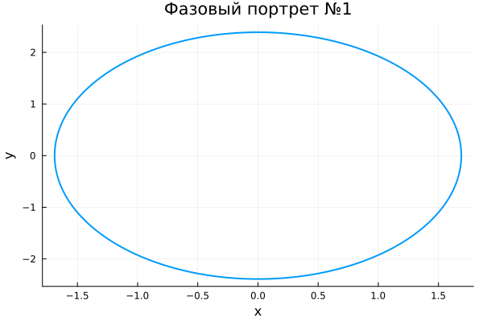
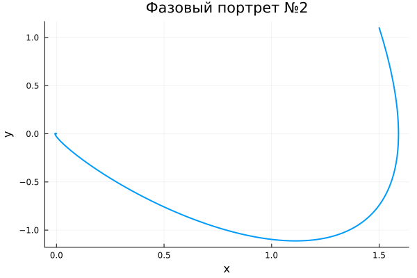
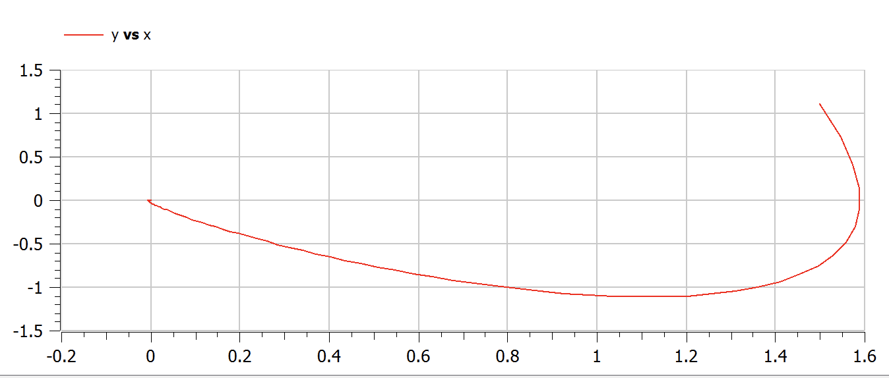
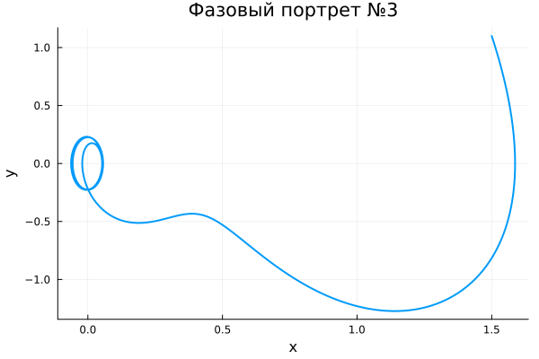

---
## Front matter
title: "Отчет по лабораторной работе №4"
subtitle: "Модель гармонических колебаний"
author: "Дмитрий Сергеевич Шестаков"

## Generic otions
lang: ru-RU
toc-title: "Содержание"

## Bibliography
bibliography: bib/cite.bib
csl: pandoc/csl/gost-r-7-0-5-2008-numeric.csl

## Pdf output format
toc: true # Table of contents
toc-depth: 2
lof: true # List of figures
lot: true # List of tables
fontsize: 12pt
linestretch: 1.5
papersize: a4
documentclass: scrreprt
## I18n polyglossia
polyglossia-lang:
  name: russian
  options:
	- spelling=modern
	- babelshorthands=true
polyglossia-otherlangs:
  name: english
## I18n babel
babel-lang: russian
babel-otherlangs: english
## Fonts
mainfont: PT Serif
romanfont: PT Serif
sansfont: PT Sans
monofont: PT Mono
mainfontoptions: Ligatures=TeX
romanfontoptions: Ligatures=TeX
sansfontoptions: Ligatures=TeX,Scale=MatchLowercase
monofontoptions: Scale=MatchLowercase,Scale=0.9
## Biblatex
biblatex: true
biblio-style: "gost-numeric"
biblatexoptions:
  - parentracker=true
  - backend=biber
  - hyperref=auto
  - language=auto
  - autolang=other*
  - citestyle=gost-numeric
## Pandoc-crossref LaTeX customization
figureTitle: "Рис."
tableTitle: "Таблица"
listingTitle: "Листинг"
lofTitle: "Список иллюстраций"
lotTitle: "Список таблиц"
lolTitle: "Листинги"
## Misc options
indent: true
header-includes:
  - \usepackage{indentfirst}
  - \usepackage{float} # keep figures where there are in the text
  - \floatplacement{figure}{H} # keep figures where there are in the text
  - \usepackage{amsmath}
---

# Цель работы

 - Научиться решать линейное однородное дифференциальное уравнение второго порядка. 
 - Построить модель линейного гармонического осциллятора без затухания/ с затуханием/ с действием внешней силы.
 - Построить фазовые портреты всех моделей.
 - Отработать навыки решения систем дифференциальных уравнений на языке Julia, Openmodelica

# Задание

1. Построить решение уравнения гармонического осциллятора без затухания.
2. Записать уравнение свободных колебаний гармонического осциллятора с затуханием, построить его решение. Построить фазовый портрет гармонических колебаний с затуханием.
3. Записать уравнение колебаний гармонического осциллятора, если на систему действует внешняя сила его решение. Построить фазовый портрет колебаний с действием внешней силы.

# Теоретическое введение

**Гармонический осциллятор** - система, которая при выведении ее из положения равновесия испытывает действие возращающей силы $F$, пропорциональной смещению $x$: $$F = -kx$$

Если $F$ — единственная сила, действующая на систему, то систему называют **простым** или **консервативным гармоническим осциллятором**. Свободные колебания такой системы представляют собой периодическое движение около положения равновесия (гармонические колебания). Частота и амплитуда при этом постоянны, причём частота не зависит от амплитуды.

Если имеется ещё и сила трения (затухание), пропорциональная скорости движения (вязкое трение), то такую систему называют **затухающим** или **диссипативным осциллятором**. Если трение не слишком велико, то система совершает почти периодическое движение — синусоидальные колебания с постоянной частотой и экспоненциально убывающей амплитудой. Частота свободных колебаний затухающего осциллятора оказывается несколько ниже, чем у аналогичного осциллятора без трения.

Если осциллятор предоставлен сам себе, то говорят, что он совершает **свободные колебания**. Если же присутствует внешняя сила (зависящая от времени), то говорят, что осциллятор испытывает **вынужденные колебания**.

Механическими примерами гармонического осциллятора являются математический маятник (с малыми углами отклонения), груз на пружине, торсионный маятник и акустические системы. Среди немеханических аналогов гармонического осциллятора можно выделить электрический гармонический осциллятор. @Oscilliator

Для *консервативного гармонического осциллятора*, используя второй закон Ньютона, имеем @Lab:
$$F = -kx \iff a = -\frac{k}{m}x$$
Обозначим ${{\omega}_0}^2 = \frac{k}{m}$ и подставим
$$\ddot{x} + {{\omega}_0}^2x = 0$$ 

Для *затухающего гармонического осциллятора*, используя второй закон Ньютона, имеем @Lab:
$$F = -kx - \alpha{v} \iff a = -\frac{k}{m}x - \frac{\alpha}{m}v$$
Обозначим ${{\omega}_0}^2 = \frac{k}{m}$, $2\gamma = \frac{\alpha}{m}$ и подставим
$$\ddot{x} + {{\omega}_0}^2x + 2\gamma{\dot{x}}= 0$$ 

Для *вынужденных колебаний*, используя второй закон Ньютона, имеем @Oscilliator:
$$ma = -kx + F_0cos(\Omega{t}) \iff a = -\frac{k}{m} + \frac{F_0}{m}cos(\Omega{t})$$
Обозначим ${{\omega}_0}^2 = \frac{k}{m}$, ${\Phi}_0 = \frac{F_0}{m}$ и подставим
$$\ddot{x} + {{\omega}_0}^2x = {\Phi}_0cos(\Omega{t})$$ 

Для решения данных дифференциальных уравнений будем составлять систему, в которой обозначим $\dot{x}$ за $y$, будем оставлять без изменений.

Например, для затухающих гармонических колебаний имеем:
$$\begin{cases}
   \dot{x} = y 
   \\
   \dot{y} = -{{\omega}_0}^2x - 2\gamma{y}
 \end{cases}$$

**Фазовая плоскость** — координатная плоскость, в которой по осям координат откладываются какие-либо две переменные (фазовые координаты), однозначно определяющие состояние системы второго порядка.

Каждая точка фазовой плоскости отражает одно некоторое состояние системы и называется *фазовой, изображающей или представляющей* точкой

Изменение состояния системы отображается на фазовой плоскости движением этой точки. След от движения изображающей точки называется **фазовой траекторией**.

Полная совокупность всевозможных различных фазовых траекторий — это **фазовый портрет**.

В нашей задаче на оси абсцисс фазовой плоскости откладываются значения параметра $x$, например, величина отклонения от равновесия; на оси ординат откладываются значения первой производной $x$ по времени($y$) — скорости перемещения. @Phase


# Выполнение лабораторной работы

1. Построим решение уравнения гармонического осциллятора без затухания. В нашем случае оно имеет вид $$\ddot{x} + 2x = 0$$
Для того, чтобы решить данное уравнение перепишем его в виде системы из двух дифференциальных уравнений первого порядка:
$$\begin{cases}
   \dot{x} = y 
   \\
   \dot{y} = -2x
 \end{cases}
$$
Далее запишем начальные условия, которые в нашем случае имеют вид:
$$
\begin{cases}
   x(0) = 1.5
   \\
   y(0) = 1.1
 \end{cases}
$$

Теперь используем язык программирования Julia для получения численного решения и построения фазового портрета
```julia
unction ode_fn_1(du, u, p, t)
    x, y = u
    du[1] = y
    du[2] = -2*x
end

t_begin = 0.0
t_end = 44
tspan = (t_begin, t_end)

#Initial condition
x_init = 1.5
y_init = 1.1

prob1 = ODEProblem(ode_fn_1, [x_init, y_init], tspan)

sol1 = solve(prob1, Tsit5(), reltol=1e-16, abstol=1e-16)
x_sol_1 = [u[1] for u in sol1.u]
y_sol_1 = [u[2] for u in sol1.u]

plot(x_sol_1, y_sol_1, 
    linewidth = 2,
    title = "Фазовый портрет №1",
    xaxis = "x",
    yaxis = "y",
    legend = false)
savefig("report/image/First.png")
```
Получим  фазовый портрет

{#fig:001 width=70%}

Теперь проделаем те же самые действия в Openmodelica

```modelica
model Oscilliator
  Real x, y, t;
initital equation
  x = 1.5;
  y = 1.1;
  t = 0;
equation
  der(t) = 1;
  der(x) = y;
  der(y) = -2*x;
end
```
Получим  фазовый портрет

{#fig:002 width=70%}

Как выидим, фазовые портреты полученнные на Julia и Openmodelica, изображенные на рис. @fig:001 и рис. @fig:002, cовпадают. 

2. Построим решение уравнения для колебаний гармонического осциллятора с затуханием и без действий внешней силы. 
В нашем случае оно имеет вид $$\ddot{x} + 3\dot{x} + 3x = 0$$
Для того, чтобы решить данное уравнение перепишем его в виде системы из двух дифференциальных уравнений первого порядка:
$$\begin{cases}
   \dot{x} = y 
   \\
   \dot{y} = -3y - 3x
 \end{cases}
$$
Далее запишем начальные условия, которые в нашем случае имеют вид:
$$
\begin{cases}
   x(0) = 1.5
   \\
   y(0) = 1.1
 \end{cases}
$$
Теперь используем язык программирования Julia для получения численного решения и построения фазового портрета

```julia
function ode_fn_2(du, u, p, t)
    x, y = u
    du[1] = y
    du[2] = -3*x - 3*y 
end

t_begin = 0.0
t_end = 44
tspan = (t_begin, t_end)

#Initial condition
x_init = 1.5
y_init = 1.1

prob1 = ODEProblem(ode_fn_2, [x_init, y_init], tspan)

sol1 = solve(prob1, Tsit5(), reltol=1e-16, abstol=1e-16)
x_sol_1 = [u[1] for u in sol1.u]
y_sol_1 = [u[2] for u in sol1.u]

plot(x_sol_1, y_sol_1, 
    linewidth = 2,
    title = "Фазовый портрет №2",
    xaxis = "x",
    yaxis = "y",
    legend = false)

savefig("report/image/Second.png")
```

Получим  фазовый портрет

{#fig:003 width=70%}

Теперь проделаем те же самые действия в Openmodelica

```modelica
model Oscilliator
  Real x, y, t;
initital equation
  x = 1.5;
  y = 1.1;
  t = 0;
equation
  der(t) = 1;
  der(x) = y;
  der(y) = -3*x - 3*y;
end
```
Получим  фазовый портрет

{#fig:004 width=70%}

Как выидим, фазовые портреты полученнные на Julia и Openmodelica, изображенные на рис. @fig:003 и рис. @fig:004, cовпадают.

3. Построим решение уравнения для колебаний гармонического осциллятора с затуханием и под действием внешней силы. 
В нашем случае оно имеет вид $$\ddot{x} + 4\dot{x} + 4x = sin(4*t)$$
Для того, чтобы решить данное уравнение перепишем его в виде системы из двух дифференциальных уравнений первого порядка:
$$\begin{cases}
   \dot{x} = y 
   \\
   \dot{y} = -3y - 3x + sin(4*t)
 \end{cases}
$$
Далее запишем начальные условия, которые в нашем случае имеют вид:
$$
\begin{cases}
   x(0) = 1.5
   \\
   y(0) = 1.1
 \end{cases}
$$
Теперь используем язык программирования Julia для получения численного решения и построения фазового портрета

```julia
function ode_fn_3(du, u, p, t)
    x, y = u
    du[1] = y
    du[2] = -3*x - 3*y - sin(4*t)
end

t_begin = 0.0
t_end = 44
tspan = (t_begin, t_end)

#Initial condition
x_init = 1.5
y_init = 1.1

prob1 = ODEProblem(ode_fn_3, [x_init, y_init], tspan)

sol1 = solve(prob1, Tsit5(), reltol=1e-16, abstol=1e-16)
x_sol_1 = [u[1] for u in sol1.u]
y_sol_1 = [u[2] for u in sol1.u]

plot(x_sol_1, y_sol_1, 
    linewidth = 2,
    title = "Фазовый портрет №3",
    xaxis = "x",
    yaxis = "y",
    legend = false)
savefig("report/image/Third.png")
```

Получим  фазовый портрет

{#fig:005 width=70%}

Теперь проделаем те же самые действия в Openmodelica

```modelica
model Oscilliator
  Real x, y, t;
initital equation
  x = 1.5;
  y = 1.1;
  t = 0;
equation
  der(t) = 1;
  der(x) = y;
  der(y) = -4*x - 4*y + sin(4*t);
end
```
Получим  фазовый портрет

{#fig:006 width=70%}

Как выидим, фазовые портреты полученнные на Julia и Openmodelica, изображенные на рис. @fig:005 и рис. @fig:006, cовпадают. 

# Ответы на вопросы

1. Простейшая модель гармонических колебаний:
$$x = A*cos(\omega{t} + {\phi}_0)$$
2. Осциллятор - система, совершающая колебания, то есть показатели которой периодически повторяются во времени.
3. Модель математического маятника:
$$\ddot{\theta} + \frac{g}{L}sin(\theta) = 0$$
4. Для перехода от дифференциального уравнения второго порядка к системе дифференциальных уравнений первого порядка, необходимо в уравнении заменить все производные первого порядка на новую переменную, а также записать дополнительное уравнения, в котором будет обозначено, что первая производная равна новой переменной
5. **Фазовый портрет** — это геометрическое представление траекторий динамической системы на фазовой плоскости

6. **Фазовая траектория** - кривая в фазовом пространстве, составленная из точек, представляющих состояние динамической системы в последовательные моменты времени в течение всего времени эволюции.


# Выводы

- Научились решать линейное однородное дифференциальное уравнение второго порядка. 
- Построиили модель линейного гармонического осциллятора без затухания/ с затуханием/ с действием внешней силы.
- Построили фазовые портреты всех моделей. Увидели, что при реализации на Julia и Openmodelica портреты совпадают.
- Отработали навыки решения систем дифференциальных уравнений на языке Julia, Openmodelica

# Список литературы{.unnumbered}

::: {#refs}
:::
