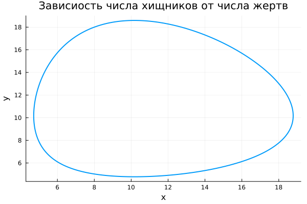
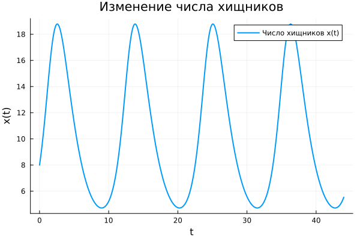
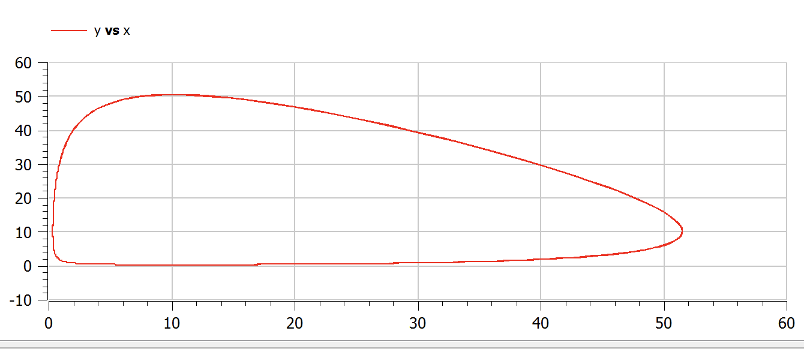
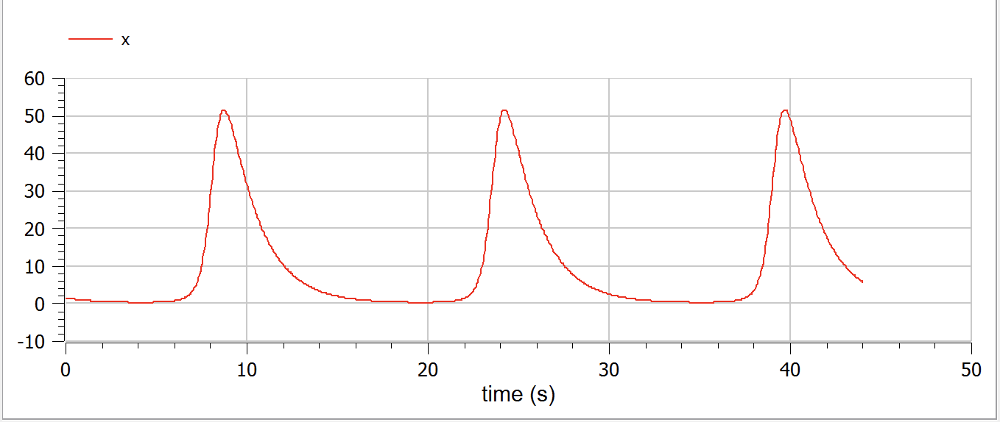
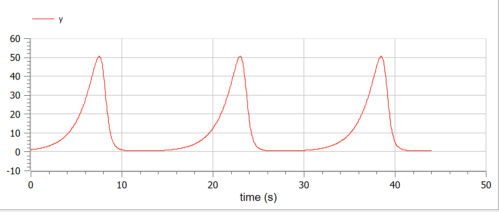

---
## Front matter
lang: ru-RU
title: Лабораторная работа №5
subtitle: Модель Лотки - Вольтерры
author:
  - Шестаков Д. С.
institute:
  - Российский университет дружбы народов, Москва, Россия
date: 11 марта 2023

## i18n babel
babel-lang: russian
babel-otherlangs: english

## Formatting pdf
toc: false
toc-title: Содержание
slide_level: 2
aspectratio: 169
section-titles: true
theme: metropolis
header-includes:
 - \metroset{progressbar=frametitle,sectionpage=progressbar,numbering=fraction}
 - '\makeatletter'
 - '\beamer@ignorenonframefalse'
 - '\makeatother'
 - \usepackage{amsmath}
---

# Информация

## Докладчик

:::::::::::::: {.columns align=center}
::: {.column width="70%"}

  * Шестаков Дмитрий Сергеевич
  * студент НКНбд-01-20
  * Факультет физико-математических и естественных наук
  * Российский университет дружбы народов
  * [dmshestakov@icloud.com](mailto:dmshestakov@icloud.com)
  * <https://github.com/tekerinkin>

:::
::::::::::::::

# Вводная часть

## Актуальность

- Моеделирование взаимоотношений "хищник - жертва" позволяет решать некоторые прикладные в области исследования популяций
- Данная задача отлично подходит для отработки навыков решения дифференциальных уравнений второго порядка на языках Julia и Openmodelica

## Объект и предмет исследования

- Модель Лотки — Вольтерры
- Язык программирования Julia
- Язык программирования Openmodelica


## Цели и задачи

- Программно реализовать модель Лотки - Вольтерры
- Построить график зависимости числа хищников от числа жертв
- Построить график изменений числа жертв
- Построить графки изменений числа хищников


## Материалы и методы

- Язык программирования Julia
- Язык программирования Modelica
- Пакеты Plots, DifferentialEquations

# Ход работы

## Постановка задачи

В моем варианте  модель описывается следующим уравнением: 
$$
 \begin{cases}
   \frac{dx}{dt} = -0.59*x(t) + 0.058*x(t)*y(t)
   \\
   \frac{dy}{dt} = 0.57*y(t) - 0.056*x(t)*y(t)
 \end{cases}
$$

Необходимо построить график зависимости численности хищников от численности жертв, а также графики изменения численности хищников и численности жертв при следующих начальных условиях: $x_0 = 8, y_0 = 18$. Найти стационарное состояние системы.

## Решение на Julia

```julia
  function ode_fn_1(du, u, p, t)
    x, y = u
    du[1] = -0.59*x + 0.058*x*y
    du[2] = 0.57*y - 0.056*x*y
  end
  #Initial condition
  x_init = 8
  y_init = 18
  prob1 = ODEProblem(ode_fn_1, [x_init, y_init], tspan)
  sol1 = solve(prob1, Tsit5(), reltol=1e-16, abstol=1e-16)
  x_sol_1 = [u[1] for u in sol1.u]
  y_sol_1 = [u[2] for u in sol1.u]
  plot(x_sol_1, y_sol_1)
  savefig("report/image/x_y.png")
  plot(sol1.t, x_sol_1)
  savefig("report/image/x.png")
  plot(sol1.t, y_sol_1)
  savefig("report/image/y.png")
```

## Графики

:::::::::::::: {.columns align=center}
::: {.column width="30%"}
{#fig:001 width=50%}
:::
::: {.column width="30%"}
{#fig:002 width=50%}
:::
::: {.column width="30%"}
{#fig:003 width=50%}
:::
::::::::::::::

## Решение на языке Openmodelica

```openmodelica
model Predator
  Real x, y, t;
initial equation
  x = 8;
  y = 18;
equation
  der(t) = 1;
  der(x) = -0.59*x + 0.058*x*y;
  der(y) = 0.57*y - 0.056*x*y;
end;
```

## Графики

:::::::::::::: {.columns align=center}
::: {.column width="30%"}
{#fig:001 width=50%}
:::
::: {.column width="30%"}
{#fig:002 width=50%}
:::
::: {.column width="30%"}
{#fig:003 width=50%}
:::
::::::::::::::

# Вывод

- Программно реализовали модель Лотки-Вольтерры на языках программирования Julia и Openmodelica.
- Получили графическое отображение зависимости числа хищников от числа жертв
- Получили графическое отображение изменения числа хищников
- Получили графическое отображение изменения числа жертв.
