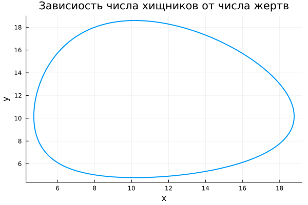
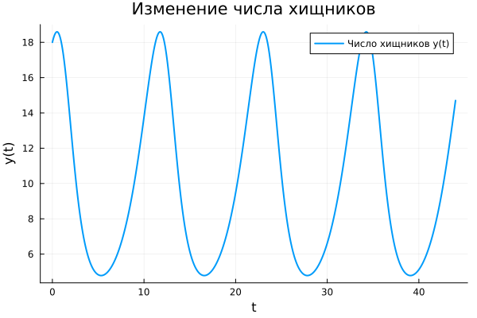
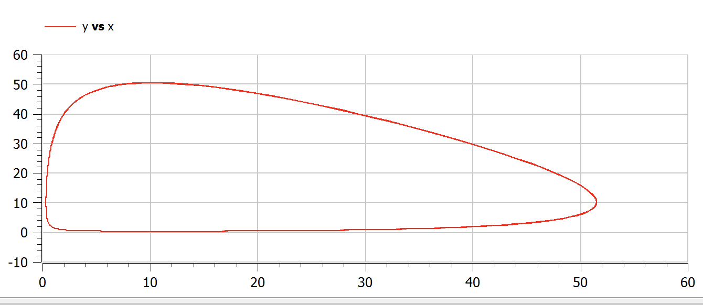
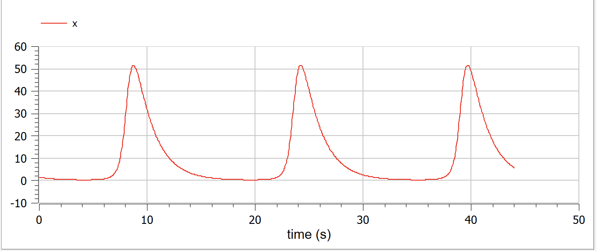

---
## Front matter
title: "Отчет по лабораторной работе №5"
subtitle: "Модель хищник-жертва"
author: "Дмитрий Сергеевич Шестаков"

## Generic otions
lang: ru-RU
toc-title: "Содержание"

## Bibliography
bibliography: bib/cite.bib
csl: pandoc/csl/gost-r-7-0-5-2008-numeric.csl

## Pdf output format
toc: true # Table of contents
toc-depth: 2
lof: true # List of figures
lot: true # List of tables
fontsize: 12pt
linestretch: 1.5
papersize: a4
documentclass: scrreprt
## I18n polyglossia
polyglossia-lang:
  name: russian
  options:
	- spelling=modern
	- babelshorthands=true
polyglossia-otherlangs:
  name: english
## I18n babel
babel-lang: russian
babel-otherlangs: english
## Fonts
mainfont: PT Serif
romanfont: PT Serif
sansfont: PT Sans
monofont: PT Mono
mainfontoptions: Ligatures=TeX
romanfontoptions: Ligatures=TeX
sansfontoptions: Ligatures=TeX,Scale=MatchLowercase
monofontoptions: Scale=MatchLowercase,Scale=0.9
## Biblatex
biblatex: true
biblio-style: "gost-numeric"
biblatexoptions:
  - parentracker=true
  - backend=biber
  - hyperref=auto
  - language=auto
  - autolang=other*
  - citestyle=gost-numeric
## Pandoc-crossref LaTeX customization
figureTitle: "Рис."
tableTitle: "Таблица"
listingTitle: "Листинг"
lofTitle: "Список иллюстраций"
lotTitle: "Список таблиц"
lolTitle: "Листинги"
## Misc options
indent: true
header-includes:
  - \usepackage{indentfirst}
  - \usepackage{float} # keep figures where there are in the text
  - \floatplacement{figure}{H} # keep figures where there are in the text
  - \usepackage{amsmath}
---

# Цель работы

Реализовать на языках программирования Julia и Openmodelica модель Лотки-Вольтерры, также известную как моедль взаимодействия "хищник-жертва".

# Задание

В лесу проживают х число волков, питающихся зайцами, число которых в этом же лесу у. Пока число зайцев достаточно велико, для прокормки всех волков, численность волков растет до тех пор, пока не наступит момент, что корма перестанет хватать на всех. Тогда волки начнут умирать, и их численность будет уменьшаться. В этом случае в какой-то момент времени численность зайцев снова начнет увеличиваться, что повлечет за собой новый рост популяции волков. Такой цикл будет повторяться, пока обе популяции будут существовать. Помимо этого, на численность стаи влияют болезни и старение. Данная модель описывается следующим уравнением: 
$$
 \begin{cases}
   \frac{dx}{dt} = -0.59*x(t) + 0.058*x(t)*y(t)
   \\
   \frac{dy}{dt} = 0.57*y(t) - 0.056*x(t)*y(t)
 \end{cases}
$$

Построить график зависимости численности хищников от численности жертв, а также графики изменения численности хищников и численности жертв при следующих начальных условиях: $x_0 = 8, y_0 = 18$. Найти стационарное состояние системы. @Lab


# Теоретическое введение

Моде́ль Лотки — Вольтерры (модель Лотки — Вольтерра) — модель взаимодействия двух видов типа «хищник — жертва», названная в честь её авторов (Лотка, 1925; Вольтерра 1926), которые предложили модельные уравнения независимо друг от друга.

Такие уравнения можно использовать для моделирования систем «хищник —жертва», «паразит — хозяин», конкуренции и других видов взаимодействия между двумя видами.

В математической форме предложенная система имеет следующий вид:
$$
  \frac{dx}{dt} = (\alpha - \beta(y))x
$$
$$
  \frac{dy}{dt} = (-\gamma + \delta{x})y
$$
где $x$ - количество жертв, $y$ - количество хищников, $t$ - время, $\alpha, \beta, \gamma, \delta$ - коэффициенты, отражающие взаимодействия между видами.

Рассматривается закрытый ареал, в котором обитают два вида — травоядные («жертвы») и хищники. Предполагается, что животные не иммигрируют и не эмигрируют, и что еды для травоядных животных имеется с избытком. Тогда уравнение изменения количества жертв (без учёта хищников) принимает вид:
$$
  \frac{dx}{dt} = \alpha{x}
$$
где $\alpha$ - коэффициент рождаемости жертв, $x$ - величина популяции жертв, $\frac{dx}{dt}$ - скорость прироста популяции жертв.

Пока хищники не охотятся, они вымирают, следовательно, уравнение для численности хищников (без учёта численности жертв) принимает вид:
$$
  \frac{dy}{dt} = -\gamma{y}
$$
где $\gamma$ - коэффициент убыли хищников, $y$ - величина популяции хищников, $\frac{dy}{dt}$ - скорость прироста популяции хищников.

При встречах хищников и жертв (частота которых прямо пропорциональна величине $xy$) происходит убийство жертв с коэффициентом $\beta$, сытые хищники способны к воспроизводству с коэффициентом $\delta$. С учетом этого, система уравнений модели такова:
$$
  \frac{dx}{dt} = (\alpha - \beta(y))x
$$
$$
  \frac{dy}{dt} = (-\gamma + \delta{x})y
$$

Для положения равновесия $\bar{x} > 0, \bar{y} > 0$ изменение численностей популяции равно нулю. Следовательно:
$$
  \alpha{\bar{x}} - \beta{\bar{x}}\bar{y} = 0
$$
$$
  -\gamma{\bar{y}} + \delta{\bar{x}\bar{y}} = 0
$$

из чего следует, что точка равновесия, вокруг которой происходят колебания, определяется следующим образом @Predator:
$$
  \bar{x} = \frac{\gamma}{\delta}
$$
$$
  \bar{y} = \frac{\alpha}{\beta}
$$

# Выполнение лабораторной работы

1. На первом этапе смоедлировали задачу, используя язык программирования Julia. Получили следующий код:

```julia
  using Plots
  using DifferentialEquations

  function ode_fn_1(du, u, p, t)
    x, y = u
    du[1] = -0.59*x + 0.058*x*y
    du[2] = 0.57*y - 0.056*x*y
  end

  t_begin = 0.0
  t_end = 44
  tspan = (t_begin, t_end)

  #Initial condition
  x_init = 8
  y_init = 18

  prob1 = ODEProblem(ode_fn_1, [x_init, y_init], tspan)

  sol1 = solve(prob1, Tsit5(), reltol=1e-16, abstol=1e-16)
  x_sol_1 = [u[1] for u in sol1.u]
  y_sol_1 = [u[2] for u in sol1.u]

  plot(x_sol_1, y_sol_1, 
      linewidth = 2,
      title = "Зависиость числа хищников от числа жертв",
      xaxis = "x",
      yaxis = "y",
      legend = false)
  savefig("report/image/x_y.png")

  plot(sol1.t, x_sol_1, 
    linewidth = 2,
    title = "Изменение числа хищников",
    xaxis = "t",
    yaxis = "x(t)",
    label = "Число хищников x(t)",
    legend = true)
  savefig("report/image/x.png")

  plot(sol1.t, y_sol_1, 
    linewidth = 2,
    title = "Изменение числа хищников",
    xaxis = "t",
    yaxis = "y(t)",
    label = "Число хищников y(t)",
    legend = true)
  savefig("report/image/y.png")
```

В результате работы программы получили следующие результаты

{#fig:001 width=70%}

{#fig:002 width=70%}

{#fig:003 width=70%}

2. На втором этапе смоделировали задачу в среде моделирования Openmodelica. Получили следующие код:

```openmodelica
model Predator
  Real x, y, t;
initial equation
  x = 8;
  y = 18;
equation
  der(t) = 1;
  der(x) = -0.59*x + 0.058*x*y;
  der(y) = 0.57*y - 0.056*x*y;
end;
```
В результате работы программы получили следующие результаты

{#fig:001 width=70%}

{#fig:002 width=70%}

{#fig:003 width=70%}

# Выводы

Программно реализовали модель Лотки-Вольтерры, также известную как моедль взаимодействия "хищник-жертва" , на языках программирования Julia и Openmodelica. Получили графическое отображение зависимости числа хищников от числа жертв, изменения числа хищников, а также изменение числа жертв.

# Список литературы{.unnumbered}

::: {#refs}
:::
