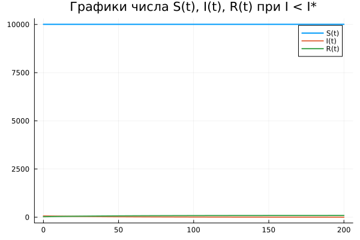
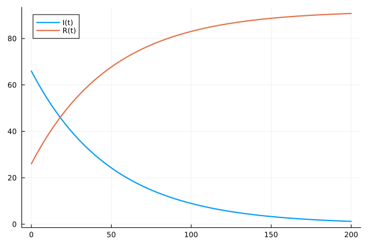
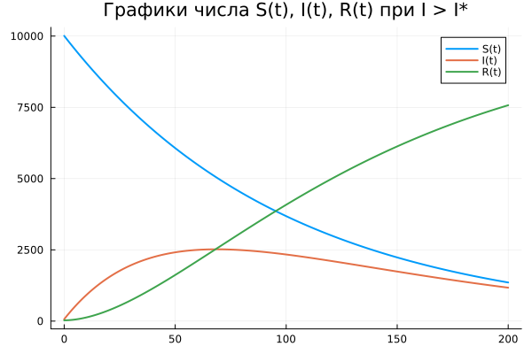

---
## Front matter
lang: ru-RU
title: Лабораторная работа №6
subtitle: Задача об эпидемии
author:
  - Шестаков Д. С.
institute:
  - Российский университет дружбы народов, Москва, Россия
date: 18 марта 2023

## i18n babel
babel-lang: russian
babel-otherlangs: english

## Formatting pdf
toc: false
toc-title: Содержание
slide_level: 2
aspectratio: 169
section-titles: true
theme: metropolis
header-includes:
 - \metroset{progressbar=frametitle,sectionpage=progressbar,numbering=fraction}
 - '\makeatletter'
 - '\beamer@ignorenonframefalse'
 - '\makeatother'
 - \usepackage{amsmath}
---

# Информация

## Докладчик

:::::::::::::: {.columns align=center}
::: {.column width="70%"}

  * Шестаков Дмитрий Сергеевич
  * студент НКНбд-01-20
  * Факультет физико-математических и естественных наук
  * Российский университет дружбы народов
  * [dmshestakov@icloud.com](mailto:dmshestakov@icloud.com)
  * <https://github.com/tekerinkin>

:::
::::::::::::::

# Вводная часть

## Актуальность

- Моеделирование изменения числа здоровых/заболевших/с иммунитетом в условиях эпидемии полезно для планирования действий для локализации эпидемии
- Данная задача отлично подходит для отработки навыков решения дифференциальных уравнений второго порядка на языках Julia и Openmodelica

## Объект и предмет исследования

- Задача об эпидемии
- Язык программирования Julia
- Язык программирования Openmodelica


## Цели и задачи

- Программно реализовать задачу об эпидемии
- Постройте графики изменения числа особей в каждой из трех групп
- Рассмотреть, как будет протекать эпидемия в случае если $I(0) <= I^{*}$
- Рассмотреть, как будет протекать эпидемия в случае если $I(0) > I^{*}$


## Материалы и методы

- Язык программирования Julia
- Язык программирования Modelica
- Пакеты Plots, DifferentialEquations

# Ход работы

## Постановка задачи

На одном острове вспыхнула эпидемия. Известно, что из всех проживающих на острове ($N = 10100$) в момент начала эпидемии ($t=0$) число заболевших людей (являющихся распространителями инфекции) $I(0)=66$, а число здоровых людей с иммунитетом к болезни $R(0)=26$. Таким образом, число людей восприимчивых к болезни, но пока здоровых, в начальный момент времени $S(0)=N-I(0)- R(0)$.

## Изменение числа здоровых

До того, как число заболевших не превышает критического значения $I^{*}$, считаем, что все больные изолированы и не заражают здоровых. Когда $I(t) > I^,  тогда инфицирование способны заражать восприимчивых к болезни особей. Таким образом, скорость изменения числа $S(t)$ меняется по следующему
закону:
$$
 \frac{dS}{dt} = \begin{cases}
  -\alpha{S}, I(t) > I^{*} \\
  0, I(t) \leq I^{*}
  \end{cases}
$$

## Изменение числа заболевших

Поскольку каждая восприимчивая к болезни особь, которая, в конце концов, заболевает, сама становится инфекционной, то скорость изменения числа инфекционных особей представляет разность за единицу времени между заразившимися и теми, кто уже болеет и лечится, т.е.:
$$
  \frac{dI}{dt} = 
  \begin{cases}
    \alpha{S} - \beta{I}, I(t) > I^{*} \\
    -\beta{I}, I(t) \leq I^{*}
  \end{cases}
$$

## Изменение числа выздоровевших

А скорость изменения выздоравливающих особей (при этом приобретающие иммунитет к болезни)
$$
  \frac{dR}{dt} = \beta{I}
$$

Постоянные пропорциональности $\alpha, \beta$ - это коэффициенты заболеваемости и выздоровления соответственно.

## Решение на Julia ($I \leq I^{*}$)

```julia
function ode_fn_1(du, u, p, t)
    x,y,z = u 
    du[1] = 0*x
    du[2] = -b*y
    du[3] = b*y
end
t_begin = 0.0
t_end = 200
tspan = (t_begin, t_end)
prob1 = ODEProblem(ode_fn_1, [S_0, I_0, R_0], tspan)
sol1 = solve(prob1, Tsit5(), reltol=1e-16, abstol=1e-16)
x_sol_1 = [u[1] for u in sol1.u]
y_sol_1 = [u[2] for u in sol1.u]
z_sol_1 = [u[3] for u in sol1.u]
```

## Решение на Julia ($I > I^{*}$)

```julia
function ode_fn_2(du, u, p, t)
    x,y,z = u 
    du[1] = -a*x
    du[2] = a*x-b*y
    du[3] = b*y
end

prob2 = ODEProblem(ode_fn_2, [S_0, I_0, R_0], tspan)

sol2 = solve(prob2, Tsit5(), reltol=1e-16, abstol=1e-16)
x_sol_2 = [u[1] for u in sol2.u]
y_sol_2 = [u[2] for u in sol2.u]
z_sol_2 = [u[3] for u in sol2.u]
```

## Графики

:::::::::::::: {.columns align=center}
::: {.column width="30%"}
{#fig:001 width=50%}
:::
::: {.column width="30%"}
{#fig:002 width=50%}
:::
::: {.column width="30%"}
{#fig:003 width=50%}
:::
::::::::::::::

## Решение на языке Openmodelica ($I \leq I^{*}$)

```openmodelica
model Predator
  Real x, y, t, z;
initial equation
  x = 10008;
  y = 66;
  z = 26;
equation
  der(t) = 1;
  der(x) = 0*x;
  der(y) = -0.02*y;
  der(z) = 0.02*y;
end;
```
## Решение на языке Openmodelica ($I > I^{*}$)

```openmodelica
model Predator
  Real x, y, t, z;
initial equation
  x = 10008;
  y = 66;
  z = 26;
equation
  der(t) = 1;
  der(x) = -0.01*x;
  der(y) = 0.01*x-0.02*y;
  der(z) = 0.02*y;
end;
```

## Графики

:::::::::::::: {.columns align=center}
::: {.column width="30%"}
.png){#fig:004 width=50%}
:::
::: {.column width="30%"}
.png){#fig:005 width=50%}
:::
::: {.column width="30%"}
.png){#fig:006 width=50%}
:::
::::::::::::::

# Вывод

- Программно реализовали задачу об эпидемии на языках программирования Julia и Openmodelica.
- Построили графики изменения числа особей в каждой из трех групп
- Рассмотрели, как будет протекать эпидемия в случае если $I(0) <= I^{*}$
- Рассмотрели, как будет протекать эпидемия в случае если $I(0) > I^{*}$
