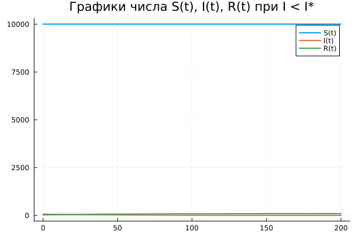
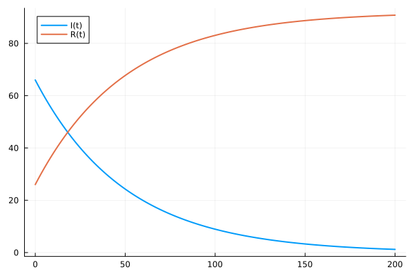
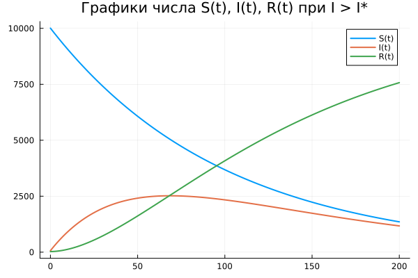

---
## Front matter
title: "Отчет по лабораторной работе №6"
subtitle: "Задача об эпидемии"
author: "Дмитрий Сергеевич Шестаков"

## Generic otions
lang: ru-RU
toc-title: "Содержание"

## Bibliography
bibliography: bib/cite.bib
csl: pandoc/csl/gost-r-7-0-5-2008-numeric.csl

## Pdf output format
toc: true # Table of contents
toc-depth: 2
lof: true # List of figures
lot: true # List of tables
fontsize: 12pt
linestretch: 1.5
papersize: a4
documentclass: scrreprt
## I18n polyglossia
polyglossia-lang:
  name: russian
  options:
	- spelling=modern
	- babelshorthands=true
polyglossia-otherlangs:
  name: english
## I18n babel
babel-lang: russian
babel-otherlangs: english
## Fonts
mainfont: PT Serif
romanfont: PT Serif
sansfont: PT Sans
monofont: PT Mono
mainfontoptions: Ligatures=TeX
romanfontoptions: Ligatures=TeX
sansfontoptions: Ligatures=TeX,Scale=MatchLowercase
monofontoptions: Scale=MatchLowercase,Scale=0.9
## Biblatex
biblatex: true
biblio-style: "gost-numeric"
biblatexoptions:
  - parentracker=true
  - backend=biber
  - hyperref=auto
  - language=auto
  - autolang=other*
  - citestyle=gost-numeric
## Pandoc-crossref LaTeX customization
figureTitle: "Рис."
tableTitle: "Таблица"
listingTitle: "Листинг"
lofTitle: "Список иллюстраций"
lotTitle: "Список таблиц"
lolTitle: "Листинги"
## Misc options
indent: true
header-includes:
  - \usepackage{indentfirst}
  - \usepackage{float} # keep figures where there are in the text
  - \floatplacement{figure}{H} # keep figures where there are in the text
  - \usepackage{amsmath}
---

# Цель работы

Реализовать на языках программирования Julia и Openmodelica задачу об эпидемии. Улучшить навыки использования пакета DifferentialEquations.

# Задание

На одном острове вспыхнула эпидемия. Известно, что из всех проживающих на острове ($N = 10100$) в момент начала эпидемии ($t=0$) число заболевших людей (являющихся распространителями инфекции) $I(0)=66$, а число здоровых людей с иммунитетом к болезни $R(0)=26$. Таким образом, число людей восприимчивых к болезни, но пока здоровых, в начальный момент времени $S(0)=N-I(0)- R(0)$.
Постройте графики изменения числа особей в каждой из трех групп. Рассмотрите, как будет протекать эпидемия в случае @Lab:
  
  1) если $I(0) <= I^{*}$
  2) если $I(0) > I^{*}$

# Теоретическое введение

Рассмотрим простейшую модель эпидемии. Предположим, что некая популяция, состоящая из $N$ особей, (считаем, что популяция изолирована) подразделяется на три группы: 
 
 - Первая группа - это восприимчивые к болезни, но пока здоровые особи, обозначим их через $S(t)$. 
 - Вторая группа – это число инфицированных особей, которые также при этом являются распространителями инфекции, обозначим их $I(t)$. 
 - Третья группа, обозначающаяся через $R(t)$ – это здоровые особи с иммунитетом к болезни.

До того, как число заболевших не превышает критического значения $I^{*}$, считаем, что все больные изолированы и не заражают здоровых. Когда $I(t) > I^,  тогда инфицирование способны заражать восприимчивых к болезни особей. Таким образом, скорость изменения числа $S(t)$ меняется по следующему
закону:
$$
 \frac{dS}{dt} = \begin{cases}
  -\alpha{S}, I(t) > I^{*} \\
  0, I(t) \leq I^{*}
  \end{cases}
$$

Поскольку каждая восприимчивая к болезни особь, которая, в конце концов, заболевает, сама становится инфекционной, то скорость изменения числа инфекционных особей представляет разность за единицу времени между заразившимися и теми, кто уже болеет и лечится, т.е.:
$$
  \frac{dI}{dt} = 
  \begin{cases}
    \alpha{S} - \beta{I}, I(t) > I^{*} \\
    -\beta{I}, I(t) \leq I^{*}
  \end{cases}
$$

А скорость изменения выздоравливающих особей (при этом приобретающие иммунитет к болезни)
$$
  \frac{dR}{dt} = \beta{I}
$$

Постоянные пропорциональности $\alpha, \beta$ - это коэффициенты заболеваемости и выздоровления соответственно.

Для того, чтобы решения соответствующих уравнений определялось однозначно, необходимо задать начальные условия. Считаем, что на начало эпидемии в момент времени $t = 0$ нет особей с иммунитетом к болезни $R(0)=0$, а число инфицированных и восприимчивых к болезни особей $I(0)$ и $S(0)$
соответственно. Для анализа картины протекания эпидемии необходимо рассмотреть два случая @Theory: 
 
 - $I(0) \leq I^{*}$
 - $I(0) > I^{*}$

# Выполнение лабораторной работы

1. На первом этапе смоедлировали задачу, используя язык программирования Julia. Получили следующий код:

```julia
a = 0.01
b = 0.02
N = 10100
I_0 = 66
R_0 = 26

S_0 = N - I_0 - R_0

# I < I*
function ode_fn_1(du, u, p, t)
    x,y,z = u 
    du[1] = 0*x
    du[2] = -b*y
    du[3] = b*y
end

t_begin = 0.0
t_end = 200
tspan = (t_begin, t_end)

prob1 = ODEProblem(ode_fn_1, [S_0, I_0, R_0], tspan)

sol1 = solve(prob1, Tsit5(), reltol=1e-16, abstol=1e-16)
x_sol_1 = [u[1] for u in sol1.u]
y_sol_1 = [u[2] for u in sol1.u]
z_sol_1 = [u[3] for u in sol1.u]

plot(sol1.t, x_sol_1, 
    linewidth = 2,
    title = "Графики числа S(t), I(t), R(t) при I < I*",
    label = "S(t)",
    legend = true)
plot!(sol1.t, y_sol_1,
     linewidth = 2,
     label = "I(t)",
     legend = true)
plot!(sol1.t, z_sol_1, 
     linewidth = 2,
     label = "R(t)",
     legend = true)
savefig("report/image/1.png")

function ode_fn_2(du, u, p, t)
    x,y,z = u 
    du[1] = -a*x
    du[2] = a*x-b*y
    du[3] = b*y
end

prob2 = ODEProblem(ode_fn_2, [S_0, I_0, R_0], tspan)

sol2 = solve(prob2, Tsit5(), reltol=1e-16, abstol=1e-16)
x_sol_2 = [u[1] for u in sol2.u]
y_sol_2 = [u[2] for u in sol2.u]
z_sol_2 = [u[3] for u in sol2.u]

plot(sol2.t, x_sol_2, 
    linewidth = 2,
    title = "Графики числа S(t), I(t), R(t) при I > I*",
    label = "S(t)",
    legend = true)
plot!(sol2.t, y_sol_2,
     linewidth = 2,
     label = "I(t)",
     legend = true)
plot!(sol2.t, z_sol_2, 
     linewidth = 2,
     label = "R(t)",
     legend = true)
savefig("report/image/3.png")
```

В результате работы программы получили следующие результаты

{#fig:001 width=70%}

{#fig:002 width=70%}

{#fig:003 width=70%}

2. На втором этапе смоделировали задачу в среде моделирования Openmodelica. Получили следующий код:

```openmodelica
model Predator
  Real x, y, t, z;
initial equation
  x = 10008;
  y = 66;
  z = 26;
equation
  der(t) = 1;
  der(x) = 0*x;
  der(y) = -0.02*y;
  der(z) = 0.02*y;
end;
```
```openmodelica
model Predator
  Real x, y, t, z;
initial equation
  x = 10008;
  y = 66;
  z = 26;
equation
  der(t) = 1;
  der(x) = -0.01*x;
  der(y) = 0.01*x-0.02*y;
  der(z) = 0.02*y;
end;
```

В результате работы программы получили следующие результаты

.png){#fig:004 width=70%}

.png){#fig:005 width=70%}

.png){#fig:006 width=70%}

# Выводы

Программно реализовали задачу об эпидемии на языках программирования Julia и Openmodelica. Получили графическое отображение изменений числа здоровых, заболевших, с иммунитетом. 

# Список литературы{.unnumbered}

::: {#refs}
:::
