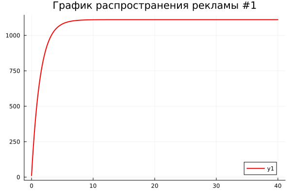
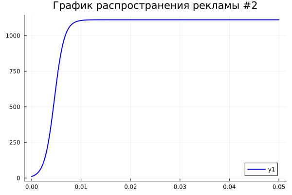
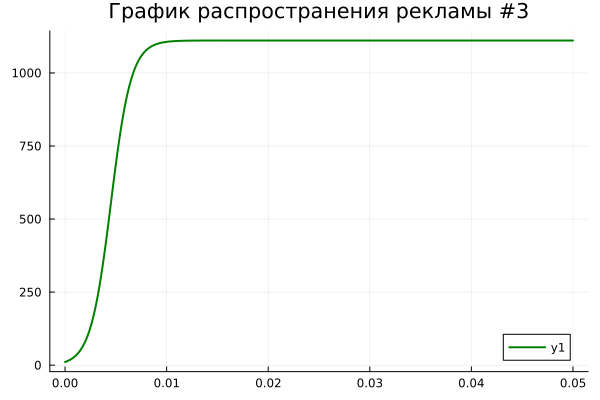

---
## Front matter
lang: ru-RU
title: Лабораторная работа №6
subtitle: Эффективность рекламы
author:
  - Шестаков Д. С.
institute:
  - Российский университет дружбы народов, Москва, Россия
date: 25 марта 2023

## i18n babel
babel-lang: russian
babel-otherlangs: english

## Formatting pdf
toc: false
toc-title: Содержание
slide_level: 2
aspectratio: 169
section-titles: true
theme: metropolis
header-includes:
 - \metroset{progressbar=frametitle,sectionpage=progressbar,numbering=fraction}
 - '\makeatletter'
 - '\beamer@ignorenonframefalse'
 - '\makeatother'
 - \usepackage{amsmath}
---

# Информация

## Докладчик

:::::::::::::: {.columns align=center}
::: {.column width="70%"}

  * Шестаков Дмитрий Сергеевич
  * студент НКНбд-01-20
  * Факультет физико-математических и естественных наук
  * Российский университет дружбы народов
  * [dmshestakov@icloud.com](mailto:dmshestakov@icloud.com)
  * <https://github.com/tekerinkin>

:::
::::::::::::::

# Вводная часть

## Актуальность

- Модель позволяет оценить эффективность рекламной стратегии и показывает скорость информирования ЦА
- Данная задача отлично подходит для отработки навыков решения дифференциальных уравнений второго порядка на языках Julia и Openmodelica

## Объект и предмет исследования

- Модель эффективности рекламы
- Язык программирования Julia
- Язык программирования Openmodelica


## Цели и задачи

- Программно реализовать модель эффективности рекламы
- Построить графики распространения рекламы, математическая модель которых описывается следующими уравнениями
 
 1) $\frac{dn}{dt} = (0.7 + 0.00002*n(t))(N - n(t))$
 2) $\frac{dn}{dt} = (0.00008 + 0.9*n(t))(N - n(t))$
 3) $\frac{dn}{dt} = (0.9cos(t) + 0.9*n(t)*cos(t))(N - n(t))$ 


## Материалы и методы

- Язык программирования Julia
- Язык программирования Modelica
- Пакеты Plots, DifferentialEquations

# Ход работы

## Постановка задачи

29 января в городе открылся новый салон красоты. Полагаем, что на момент
открытия о салоне знали $N_0 = 11$ потенциальных клиентов. По маркетинговым
исследованиям известно, что в районе проживают $N = 1111$ потенциальных клиентов салона. Поэтому после открытия салона руководитель запускает активную рекламную компанию. После этого скорость изменения числа знающих о салоне пропорциональна как числу знающих о нем, так и числу не знаю о нем.


## Решение на Julia (график №1)

```julia
N = 1111
ode_fn(r, p, t) = (0.7 + 0.00002*r)*(N - r)
t_begin = 0.0
t_end = 40.0
tspan = (t_begin, t_end)
r0 = 11
prob1 = ODEProblem(ode_fn, r0, tspan)
sol1 = solve(prob1, Tsit5(), reltol=1e-16, abstol=1e-16)
plot(sol1.t, sol1, linewidth = 2,title = "График распространения рекламы #1",
     color =:red,
     legend = true)
```

## Решение на Julia (график №2)

```julia
ode_fn1(r, p, t) = (0.00008 + 0.9*r)*(N - r)
t_begin = 0.0
t_end = 0.05
tspan = (t_begin, t_end)
prob2 = ODEProblem(ode_fn1, r0, tspan)
sol2 = solve(prob2, Tsit5(), reltol=1e-16, abstol=1e-16)
plot(sol2.t, sol2, linewidth = 2,title = "График распространения рекламы #2",
     color =:blue,
     legend = true)
```

## Решение на Julia (график №3)

```julia
ode_fn1(r, p, t) = (0.9*cos(t) + 0.9*r*cos(t))*(N - r)
t_begin = 0.0
t_end = 0.05
tspan = (t_begin, t_end)
prob2 = ODEProblem(ode_fn1, r0, tspan)
sol2 = solve(prob2, Tsit5(), reltol=1e-16, abstol=1e-16)
plot(sol2.t, sol2, linewidth = 2,title = "График распространения рекламы #3",
     color =:blue,
     legend = true)
```

## Графики

:::::::::::::: {.columns align=center}
::: {.column width="30%"}
{#fig:001 width=70%}
:::
::: {.column width="30%"}
{#fig:002 width=70%}
:::
::: {.column width="30%"}
{#fig:003 width=70%}
:::
::::::::::::::

## Решение на языке Openmodelica (график №1)

```openmodelica
model Advertisment
  Real x, t;
initial equation
  x = 11;
equation
  der(t) = 1;
  der(x) = (0.7 + 0.00002*x)*(1111 - x);
end;
```
## Решение на языке Openmodelica (график №2)

```openmodelica
model Advertisment
  Real x, t;
initial equation
  x = 11;
equation
  der(t) = 1;
  der(x) = (0.00008 + 0.9*x)*(1111 - x);
end;
```

## Решение на языке Openmodelica (график №3)

```openmodelica
model Advertisment
  Real x, t;
initial equation
  x = 11;
equation
  der(t) = 1;
  der(x) = (0.9*cos(t) + 0.9*x*cos(t))*(1111 - x);
end;
```

## Графики

:::::::::::::: {.columns align=center}
::: {.column width="30%"}
.png){#fig:004 width=50%}
:::
::: {.column width="30%"}
.png){#fig:005 width=50%}
:::
::: {.column width="30%"}
.png){#fig:006 width=50%}
:::
::::::::::::::

# Вывод

- Программно реализовали задачу об эпидемии на языках программирования Julia и Openmodelica.
- Построили графики распространения рекламы, математическая модель которых описывается следующими уравнениями
 
 1) $\frac{dn}{dt} = (0.7 + 0.00002*n(t))(N - n(t))$
 2) $\frac{dn}{dt} = (0.00008 + 0.9*n(t))(N - n(t))$
 3) $\frac{dn}{dt} = (0.9cos(t) + 0.9*n(t)*cos(t))(N - n(t))$ 