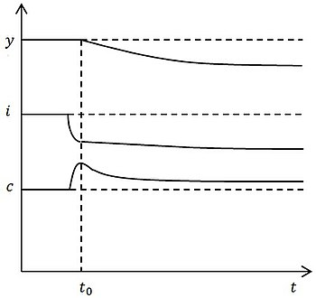

---
## Front matter
title: "Реферат"
subtitle: "Модель экономического роста Солоу"
author: "Шестаков Дмитрий Сергеевич"

## Generic otions
lang: ru-RU
toc-title: "Содержание"

## Bibliography
bibliography: bib/cite.bib
csl: pandoc/csl/gost-r-7-0-5-2008-numeric.csl

## Pdf output format
toc: true # Table of contents
toc-depth: 2
lof: true # List of figures
lot: true # List of tables
fontsize: 12pt
linestretch: 1.5
papersize: a4
documentclass: scrreprt
## I18n polyglossia
polyglossia-lang:
  name: russian
  options:
	- spelling=modern
	- babelshorthands=true
polyglossia-otherlangs:
  name: english
## I18n babel
babel-lang: russian
babel-otherlangs: english
## Fonts
mainfont: PT Serif
romanfont: PT Serif
sansfont: PT Sans
monofont: PT Mono
mainfontoptions: Ligatures=TeX
romanfontoptions: Ligatures=TeX
sansfontoptions: Ligatures=TeX,Scale=MatchLowercase
monofontoptions: Scale=MatchLowercase,Scale=0.9
## Biblatex
biblatex: true
biblio-style: "gost-numeric"
biblatexoptions:
  - parentracker=true
  - backend=biber
  - hyperref=auto
  - language=auto
  - autolang=other*
  - citestyle=gost-numeric
## Pandoc-crossref LaTeX customization
figureTitle: "Рис."
tableTitle: "Таблица"
listingTitle: "Листинг"
lofTitle: "Список иллюстраций"
lotTitle: "Список таблиц"
lolTitle: "Листинги"
## Misc options
indent: true
header-includes:
  - \usepackage{indentfirst}
  - \usepackage{float} # keep figures where there are in the text
  - \floatplacement{figure}{H} # keep figures where there are in the text
  - \usepackage{amsmath}
  - \usepackage{mathtools}
---

# Введение

Мы живем сегодня в переходной экономике постсоциалистического типа. Это проявляется, прежде всего, в том, что экономика, лишившись прежних плановых механизмов формирования пропорций, не обрела пока и новых механизмов рыночного типа. Речь идет о маргинальной роли фондового рынка, о слабости кредитно-финансовых институтов, об отсутствии сбалансированного механизма взаимодействия частного капитала и государства.

Это порождает крайне важные последствия двоякого рода: во-первых, рыночные механизмы саморегуляции обладают крайне ограниченными возможностями изменения межотраслевых пропорций в ответ на сигналы товарных рынков; во-вторых, механизмы кратко- и среднесрочных экономических циклов развития в России не работают, поскольку они опираются именно на рыночное саморегулирование, и потому логика чередования фаз этих циклов для нашей страны еще не сложилась.

Прямое следствие такого положения - крайняя затрудненность прогнозирования изменений экономической ситуации в стране и выработки методов управления этими изменениями в соответствии с национальными приоритетами. Поэтому в условиях России невозможно строить экономическую политику путем прямого следования рекомендациям теорий экономического роста, получивших ныне наибольшее научное признание.

Известно, что в мировой экономической науке сегодня существуют два круга исследовательских работ: 

* исследование закономерностей экономического роста в промышленно развитых странах; 
* изучение закономерностей экономического развития в так называемых «слабо развитых странах».

Проблематика экономического роста исследовалась в трудах многих выдающихся экономистов. Одним из выдающихся представителей экономической теории, исследовавшими закономерности и условия экономического роста, был Роберт Солоу (р. 1924 г.), американский экономист, удостоенный в 1987 г. Нобелевской премии по экономике. Работы Солоу посвящены экономическому росту (ему принадлежит одна из признанных неоклассических моделей роста), сравнительному изучению различных факторов роста, влиянию технологических открытий на развитие экономики, урбанизацией, землепользованием, занятостью.

Рассмотрим более подробно неоклассическую модель экономического роста Р. Солоу.

# Терминология и обозначения

Для лучшего понимания последующего содержания реферата и уравнений, используемых в модели, необходимо ввести некоторые обозначения и термины:

* Труд($L$) – количество рабочих (часов)
* Капитал(K) - совокупность созданных человеком ресурсов производства: оборудование, инструменты, производственные здания, транспортные средства, сырье.
* Параметр технологического прогресса($E$) – влияние технологического прогресса на производительность труда 
* Норма сбережений($s$) – доля дохода, сберегаемая домохозяйством
* Норма выбытия капитала($\delta$) – доля выбывающего капитала, то есть доля капитал непригодного к использованию посел каждой итерации
* Производственная функция [$Y(K,L,E)$] – зависимость между факторами производства и выпуском продукции(так как модель Солоу исследует экономический рост государаства, то под выпуском продукции понимается реальный ВВП).
* Объем реального ВВП($Y$) - это общая денежная стоимость всех конечных товаров и услуг, произведенных и проданных страной за определенный период времени
* Инвестиции($I$)
* Потребление(C)
* Темпы технологического прогресса($g$)

# Определение

Модель Солоу  — модель экзогенного экономического роста, основанная на экзогенной норме сбережений и неоклассической производственной функции.

Модель Солоу считают отправной точкой для всех современных моделей экономического роста, которым она дала необходимую математическую базу для анализа темпов изменения капитала. Модель оказала влияние на всю макроэкономическую теорию.

Разработана одновременно и независимо друг от друга Робертом Солоу и Тревором Своном в 1956 году.

Одним из недостатков модели является экзогенный характер нормы сбережений, то есть модель не учитывает оптимизационного поведения потребителей (модель, учитывающая указанное поведение, называется неоклассической моделью экономического роста). Также модель приводит к нереалистичной оценке ставки процента в развивающихся странах.

Экономический рост – это увеличение реального ВВП при полной занятости в результате расширения производственного потенциала страны за определенный период времени. Для оценки темпов роста используется следующая формула:
$$\dot{Y} = \frac{\delta{Y}}{Y_{t-1}}*100%$$

# Цели

Исследуя данную модель,Роберт Солоу и Тревор Свон стремились ответить на ряд вопросов:

1. Каковы факторы сбалансированного экономического роста?
2. Какой темп роста может позволить себе экономика при заданных параметрах экономической системы?
3. Как при этом максимизировать доход на душу населения и объем потребления?
4. Какое влияние на темпы роста экономики оказывают рост населения, накопление капитала и технический прогресс?

# Допущения

Важной особенностью модели является априорное предположение, что капитал подвержен убыванию доходности в закрытой экономике - при фиксированном количестве труда, влияние на выпуск последнего задействованого единичного объёма капитала всегда будет меньше, чем предыщушие единичные объёмы. Предполагая для простоты, что нет технологического прогресса или роста объёма рабочей силы, убывающая доход подразумевает, что в какой-то момент объёма нового произведённого капитала будет достаточно лишь для компенсации потерянного в виде амортизации. В результате получается, что

- при неизменном уровне технологий и без роста рабочей силы экономика в модели обязательно перестаёт расти;
- при ненулевом росте труда усложняются рассуждения, но по-прежнему сохраняется основная логика — в краткосрочной перспективе скорость роста замедляется как уменьшающаяся доходность, и экономика сходится к постоянному «устойчивому состоянию» (то есть без дальнейшего роста доходов на душу населения);
- рост технологии очень похож на предположение о ненулевом росте рабочей силы с точки зрения «эффективного труда»: новое устойчивое состояние достигается выходом на стабильные ежедневный выпуск, но в этом случае доход на душу населения растёт пропорционально росту технологического прогресса в «устойчивом состоянии».

# Базовые предпосылки модели

1. В модели рассматривается закрытая экономика. Это означает, что в модели отсутствуют такие понятия как экспорт/импорт, и весь полученный продукт тратится на потребление и инвестиции/возмещение выбывающего капитала. Данное утверждение можно записать следующими формуло $S = I = sY, Y = C + I$
2. Фирмы максимизируют прибыль
3. Фирмы функционируют в условиях совершенной конкуренции, то есть ни одна из фирм не может существенно изменить цену.
4. Производится только один продукт $Y$, используемый, как для потребления, так и для инвестиций. 
5. Темпы технологического прогресса, роста населения, норма выбытия капитала  - постоянны и задаются экзогенно. 
6. В модели отсутствует фискальная политика, то есть государственные расходы и налоги.
7. Время изменяется непрерывно.
8. Производственная функция $Y(K, L, E)$ удовлетворяет неоклассическим предпосылкам и имеет вид $Y(K, LE) = K^{\alpha}(LE)^{1-\alpha}$
9. Поведение потребителей в явном виде в модели не рассматриваются.
10. Функция полезности отсутствует.

# Стационарное состояние модели

Для данной модели исследуется стационарное состояние, в которое стремится система. То есть такое количество капитала, при котором все инвестиции бдут достаточны только для покрытия износа капитала и дальнейшее увеличение капитала возможно лишь при росте темпов технологического прогресса. 

Для того, чтобы найти такое состояние запишем производную капитала:
$$\dot{K} = sY_t - \delta{K_t}$$

Теперь запишем проивзодную удельной капиталовооруженности $k = \frac{K}{LE}$:
$$\dot{k} = \frac{\dot{K}}{LE} - \frac{K(\dot{L}E + \dot{E}L)}{(LE)^2} = \frac{sY - \delta{K}}{LE} - \frac{K}{LE}(\frac{\dot{L}}{L} + \frac{\dot{E}}{E}) 
  = sf(k) - (n + g + \delta)k$$

Отсюды следует, что если инвестиции превышают выбытие капитла, то капиталовооруженность труда с постоянной эффективностью растет, в противном случае - падает.
В стационарном состоянии уровень капитла на единицу эффективного труда постоянен, то есть $\dot{k} = 0$, а значит устойчивый уровень капиталовооруженности труда с постоянной эффективностью $k^{*}$ находится из уравнения: $$sf(k^{*}) = (n+g+\delta)k^{*}$$

{#fig:001 width=50%}

На риc. @fig:001 мы можем видеть, как графически выглядит состояние равновесия. Мы видим три графика:
* синий - показывает удельный выпуск продукта в зависимости от количества удленой капиталовооруженности
* красный - показывает удельные сбережения
* черный - показывает удельное выбытие капитала

В точке $k^{*}$ красный и черный график пересекаются, что означает равенство инвестиций в восстановление капитала равно выбытию капитала. Очевидно, что эта точка стационарна, так как если $k < k^{*}$, то капитал будет увеличиваться из-за того, что инвестиций больше чем выбытия капитала. Если $k > k^{*}$, такое возможно, если у нас единовременно сущесвтенно сократилось количество рабочих, то количество капитала будет снижаться, вследствие нехватки инвестиций для покрытия выбытия.

Также из графика отлично видно, что чем меньше количество капитала, тем выше скорость роста выпуска продукта.

{#fig:002 width=50%}

Из рис. @fig:002 мы видим, что при росте нормы сбережений инвестиции превышают выбытие капитала, $k$ растет до достижения равновесия при более высоком уровне 
$k$. В процессе перехода к новому стационарному состоянию темп роста производительности труда будет опережать темп технического прогресса и при достижении нового равновесия они сравняются.

# Золотое правило накопления

Из-за того, что в модели Солоу все фирмы старются максимизировать прибыль, исследователи решили найти такой уровень нормы сбережений при котором уровень потребления будет макисмальным. То есть решить следующую оптимизационную задачу: $$max_s c[k(s)]$$ при условии: $$\dot{k} = 0$$.

Выразив $c$ через $k$, получим:
$$c[k(s)] = (1-s)y = f[k(s)] - (n+g+\delta)k(s)$$

Проивзодная $\frac{\partial c}{\partial s}$ равна:
$$\frac{\partial c}{\partial s} = (\frac{\partial f}{\partial k} - (n+g+\delta))\frac{\partial k}{\partial s}$$

В точке максимума производная равна нулю. Заметим, что $\frac{\partial k}{\partial s} > 0$, так как при росте нормы сбережений растет удельная каиталовооруженность. Отсюда следует, что в точке максимума: $$\frac{\partial f(k^{**})}{\partial k} = n + g + \delta$$

Таким образом, норма сбережений, максимизирующая прибыль, находится из решения система уравнений:
$$\begin{cases}
  s^{*}f(k^{**}) = (n+g+\delta)k^{**} \\
  \frac{\partial f(k^{**})}{\partial k} = n + g + \delta
\end{cases}$$

В результате решения этой системы оптимальная норма сбережения, соответствующие «Золотому правилу», равна эластичности выпуска по капиталу:
$$s^{*} = \frac{k^{**}}{f(k^{**})} \times \frac{\partial f(k^{**})}{\partial k}$$

{#fig:003 width=50%}

Графически "Золтое правило" изображено на рис. @fig:003. 

Выбирается такая норма сбережений, при которой наклоно кривой $f(k)$ равен $n+g+\delta$, поскольку именно в этой точке превышение кривой $f(k)$ над кривой 
$(n+g+\delta)k$, которое и составляет потребление, максимально. Таким образом, норма сбережений, обеспечивающая максимальный устойчивый уровень потребления, равна эластичности выпуска по капиталу в устойчивом состоянии, соответствующему этой норме сбережений. Полученное значение $s^{*}$ назваются "Золотым правилом" нормы сбережения, а $k^{**}$ - капиталовооруженностью на единицу эффективного труда, соответствующей "Золотому правилу".

{#fig:004 width=50%}

На рис. @fig:004 показано, что если норма сбережений выше «Золотого правила», то при её снижении до уровня «Золотого правила» потребление 
сначала резко растет, затем снижается, но в итоге стабилизируется на уровне выше исходного.

{#fig:005 width=50%}

На рис. @fig:005 показано, что если норма сбережений ниже "Золотого правила",  то при её росте до уровня «Золотого правила» потребление 
сначала снижается, но затем растет и превышает исходный уровень.

# Конвергенция

Для оценки скорости приближения к устойчивому состоянию, нужно оценить величину $\frac{\dot{k}}{k}$. Для этого нужно разделить уравнение $\dot{k} = 0$ на $k$.

$$\frac{\dot{k}}{k} = \frac{sf(k)}{k} - (n+g+\delta) = (n+g+\delta)(\frac{f(k)k^{*}}{f(k^{*})k} - 1)$$

Отсюда следует, что при условии $k_0 < k^{*}$, чем дальше страна находится от равновесного состояния, тем выше темпы ее роста.

Таким образом, модель Солоу предполагает условную конвергенцию, то есть, что бедные страны будут расти быстрее богатых и в конце концов достигнут их уровня благосостояния при условии, что структурные параметры их экономик одинаковы.

# Преимущества и недостатки

* **Преимущества:**

  - Модель Солоу дала необходимую математическую базу (построение фазовой плоскости) для анализа темпов изменения капитала и экономического эффекта экономического прогресса, на которой в дальнейшем исследователи создали множество более сложных моделей, потому её считают отправной точкой для всех современных исследований экономического роста. Модель оказала влияние на всю макроэкономическую теорию.

* **Недостатки:**
  - Модель не показывает, каким образом решения домохозяйств влияют на норму сбережения и, вместе с решениями фирм, на темпы экономического роста.
  - Параметры нормы сбережений и темпов научно-технического прогресса в модели просто задаются экзогенно, решения экономических агентов на них никак не влияют, что не устраивало исследователей
  - Эмпирическая проверка ряда положений модели показала, что они не находят подтверждения на практике

# Выводы

* Существует оптимальный запас капитала K*(стационарное состояние: запас капитала стабилизируется)
* Пока запас капитала меньше стационарного уровня увеличение капитала приводит к росту выпуска, но темпы его роста замедляются
* Если запас капитала выше стационарного уровня, то капитал начинает выбывать, так как инвестиций недостаточного для компенсации его износа
* Накопление капитала может быть источником роста для бедных стран, в которых капитала мало. Однако когда капитала становится много (капитал достигает устойчивого уровня) экономика дальше за счет его увеличения расти не может
* Если сберегать больше, то можно добиться временного увеличения темпов экономического роста
* В устойчивом состоянии экономика растет с постоянным темпом научно-технического прогресса.

# Список литературы{.unnumbered}

1. Асемоглу Д. Введение в теорию современного экономического роста: в 2 кн. Книга 1 = Introduction to Modern Economic Growth (2009). — М.: Издательский дом «Дело» РАНХиГС, 2018
2. Сафрончук М.В. Экономический рост (гл.25, параграфы 1-6) // Курс экономической теории: учебник – 5-е исправленное, дополненное и переработанное издание – Киров: АСА, 2004. – С. 605-644. 
3. Экономический рост //[Электронный ресурс].  URL: http://economy.ranepa.ru/new/wp-content/uploads/2017/03/Lektsiya-3-Ekonomicheskij-rost.pdf
4. Модель Солоу // Википедия [Электронный ресурс].  URL: https://ru.wikipedia.org/wiki/Модель_Солоу

